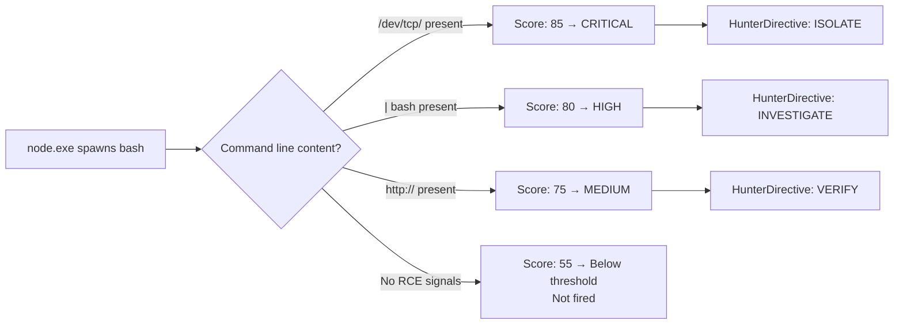

# Composite Sensor — NodeJS_SuspiciousChildProcesses

**Architecture:** 1 — Composite Sensor  
**Author:** Ala Dabat | MTDF 2026  
**MITRE ATT&CK:** T1059.007 · T1059.001  
**Platform:** MDE Advanced Hunting — Linux + Windows  
**Lifecycle:** Production-Candidate (ADX validation pending)  
**Base Score:** 55 · **Threshold:** ≥ 75  
**Anchoring:** Intent-First  

---

## Purpose

High-confidence production alert for Node.js child process abuse with RCE intent. Fires when the minimum truth is confirmed: Node.js spawned a shell, downloader, or interpreter with command-line evidence of remote code execution.

This rule covers the following attack vectors:

- Server-Side JavaScript Injection → bash reverse shell
- Prototype pollution → EJS RCE → bash/powershell
- Command injection → shell escape
- Deserialisation attack → exec()
- Supply chain postinstall hook
- Download-and-execute: `node → curl | bash`
- Windows PowerShell cradle: `node → powershell IEX DownloadString`

---

## Minimum Truth

```
node.exe OR node
    spawns ANY OF:
        bash / dash / sh / zsh / fish / busybox (Linux shells)
        curl / wget / nc / ncat / socat (Linux network tools)
        python / python3 / perl / ruby / lua (interpreters)
        powershell.exe / pwsh.exe / cmd.exe (Windows shells)
        certutil.exe / bitsadmin.exe / mshta.exe (Windows LOLBins)
    WITH command-line content indicating RCE intent
```

---

## Scoring Model

| Signal | Score | Why |
|--------|-------|-----|
| Base (minimum truth met) | +55 | Node → dangerous child is structural truth |
| `/dev/tcp/` or socket reverse shell | +30 | Near-certain malicious |
| PowerShell IEX/DownloadString cradle | +30 | Confirmed download-and-execute |
| Pipe-to-shell (`\| bash`, `\| sh`) | +25 | Download-and-execute chain |
| Remote URL in command line | +20 | External staging indicator |
| Base64/encoded command | +15 | Obfuscation intent |
| CI/CD managed environment | -25 | Soft penalty — not hard exclusion |

## Minimum Fire Paths

```
Base 55 + HasReverseShell 30  = 85 ≥ 75  ✓
Base 55 + HasWindowsCradle 30 = 85 ≥ 75  ✓
Base 55 + HasPipeToShell 25   = 80 ≥ 75  ✓
Base 55 + HasRemoteURL 20     = 75 ≥ 75  ✓
```

---

## When It Fires



---

## Analyst Actions on Fire

| Severity | Score | Immediate Action |
|----------|-------|-----------------|
| CRITICAL | ≥ 110 | Isolate device immediately. Pivot DeviceNetworkEvents for C2. |
| HIGH | ≥ 90 | Review full command line. Check network connections. |
| MEDIUM | ≥ 75 | Verify CI/CD context. Escalate if not expected. |

---

## Known Noise Sources

| Source | Description | Mitigation |
|--------|-------------|------------|
| Jenkins CI/CD | Node.js build scripts spawn bash legitimately | -25 soft penalty via `IsManagedEnv` |
| Docker build steps | npm scripts may invoke bash | Scope by `InitiatingProcessFolderPath` |
| Local dev environments | Developers run shells from Node scripts | Filter by `AccountName` if needed |

---

## Primitive Backing

**NodeJS_ChildProcess_Atomic** must be deployed before or simultaneously with this composite. The 30-day index enables retrospective stitching when this alert fires.

## Cousin Sensors (build next)

1. `PHP_exec_Abuse` — php-fpm spawning bash/curl (T1059.004)
2. `Python_subprocess_Abuse` — gunicorn/uwsgi spawning shells (T1059.006)
3. `Java_Runtime_Exec_Abuse` — Tomcat/Spring spawning cmd/bash (T1059)
