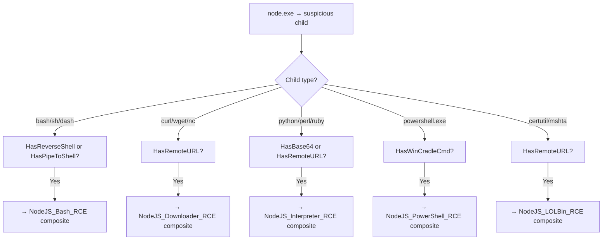

# Router Rule — NodeJS_ChildProcess_Abuse_Router

**Architecture:** 2 — Router Rule (Temporary)  
**Author:** Ala Dabat | MTDF 2026  
**MITRE ATT&CK:** T1059.007  
**Platform:** MDE Advanced Hunting — Linux + Windows  
**Lifecycle:** Temporary — decomposition tracker active  
**Base Score:** 0 · **Threshold:** ≥ 30  

---

## Purpose

Broad triage surface covering all Node.js child process abuse variants. Routes analysts to the correct dedicated composite sensor per child tool category.

This rule exists because different child tools have **radically different legitimate use profiles** — bash, curl, python, and powershell.exe cannot share a single composite without creating blind spots that cannot be tuned.

---

## Why a Router Rule and Not a Composite?

| Child Tool | Primary Legitimate Use | Noise Domain |
|-----------|----------------------|-------------|
| `bash` / `sh` | CI/CD shell scripts | Jenkins, GitLab runners |
| `curl` / `wget` | Service health checks, API calls | DevOps automation |
| `python` / `python3` | Data pipelines, ML workflows | Data engineering |
| `powershell.exe` | Windows automation | IT administration |

If these were combined into a single composite with one suppression model:
- A penalty for CI/CD would over-suppress the curl path
- A penalty for DevOps would over-suppress the bash path
- Blind spots would be created that cannot be independently tuned

The router separates them. Each gets its own composite with its own suppression model.

---

## Routing Logic

---

## Decomposition Tracker

| Technique | Target Composite | Status | Retirement Trigger |
|-----------|-----------------|--------|--------------------|
| Node → bash/sh/dash | `NodeJS_Bash_RCE` | 🔴 Pending | When composite is ADX-validated |
| Node → curl/wget/nc | `NodeJS_Downloader_RCE` | 🔴 Pending | When composite is ADX-validated |
| Node → python/ruby/perl | `NodeJS_Interpreter_RCE` | 🔴 Pending | When composite is ADX-validated |
| Node → powershell.exe | `NodeJS_PowerShell_RCE` | 🔴 Pending | When composite is ADX-validated |
| Node → certutil/mshta | `NodeJS_LOLBin_RCE` | 🔴 Pending | When composite is ADX-validated |

When all five composites are ADX-validated and deployed, this router rule should be retired. Update this tracker accordingly.

---

## Scoring

Base score is **0** — router rules never assert minimum truth on their own. Threshold is **≥ 30** — low enough to catch early signals.

| Signal | Points | Why |
|--------|--------|-----|
| Reverse shell pattern | +40 | Highest confidence RCE indicator |
| Pipe-to-shell | +30 | Strong download-and-execute signal |
| Remote URL | +25 | External staging |
| Base64/encoded | +20 | Obfuscation |
| Windows cradle command | +20 | PowerShell-specific RCE |
| Shell child type | +10 | Baseline signal — needs reinforcement |
| Managed parent process | -15 | Soft penalty for known managed tooling |

---

## Relationship to Composite Sensor

This router and `NodeJS_SuspiciousChildProcesses` (composite) overlap in coverage. They are not duplicates — they serve different purposes:

- **Router:** Low threshold, routes by tool type, drives decomposition into dedicated composites
- **Composite:** High threshold, confirms minimum truth, generates production incidents

Both should be deployed. The router catches lower-signal events the composite does not fire on.
