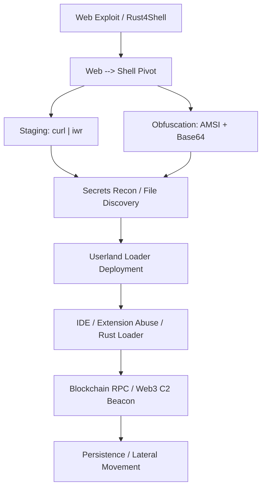

# L3 Analyst Handbook – Unified Threat Detection Framework
## Rust4Shell + EtherRAT (with IDE / Extension abuse and RPC correlation)

**Author:** Ala Dabat (azdabat)  
**Version:** 2025-L3  
**Repository:** Core-Threat-Hunts  
**Classification:** TLP:CLEAR / Operational Guidance

---

## Table of Contents
1. Purpose & Audience
2. Behavioural Detection Philosophy (L3 Focus)
3. Combined Threat Ecosystem & Diagrams
4. Deep Behavioural Notes per Detection Rule
5. Correlation & High‑Value Signal Flow
6. Detailed attack explanation: Rust4Shell + EtherRAT
7. MITRE mapping by attack stage
8. L3 Pivot Guidance
9. Appendix A — High‑Value Signals
10. Appendix B — Suppression vs Escalation Rules
11. Appendix C — Advanced KQL Pivot Kits

---

## 1. Purpose & Audience

This handbook is a **single source of truth** for L3 analysts, threat hunters, and detection engineers working on:

- **Rust4Shell-class** web exploitation and post-RCE behaviour.
- **EtherRAT-style** implants and Web3-aware supply-chain compromise.
- **IDE/Extension abuse** pathways bridging development tools with adversary C2.
- **High-fidelity correlation hunts** that reduce noise and raise P1 decisions.

---

## 2. Behavioural Detection Philosophy (L3 Focus)

### 2.1 Execution Context > Indicators
A command line alone means little; **who spawns it, from where, and under what context** is critical.

### 2.2 Cross-family behavioural clusters
Rust4Shell-style exploitation and EtherRAT implants share strong post-exploit behaviours:
- **Web → Shell pivots**
- **Staging and obfuscation**
- **Secrets discovery**
- **Userland loaders**
- **RPC-style C2**

### 2.3 Intent signals trump single indicators
Priority is given to signals that prove **evasion, staging, credential theft, stealth loaders, and unauthorized outbound C2** over mere presence of known tools.

---

## 3. Combined Threat Ecosystem & Diagrams

### 3.1 Unified Attack Path




---

## 4. Deep Behavioural Notes per Detection Rule

### 4.1 WebRCE_ProcessPivot (RCE Core)
* **Detection:** Web server runtimes (rust, node, apache) spawning shells (`sh`, `bash`, `cmd`, `pwsh`).
* **L3 Note:** Severity is P1 if the shell context is the web root or service account.
* **MITRE:** T1190 (Exploit Public-Facing App).

### 4.2 WebRCE_Staging (Ingress Tool Transfer)
* **Detection:** Staged retrieval via `curl|bash` or `iwr` pipe-to-shell.
* **L3 Note:** Minimal disk footprint; often retrieves the next-stage EtherRAT loader.

### 4.3 Obfuscation / AMSI Bypass
* **Detection:** Encoded payloads, `[Ref].Assembly.GetType`, or long Base64 strings.
* **L3 Note:** Core signal of operator intent to defeat EDR/AMSI.

### 4.4 Secrets Recon (Behavioural Discovery)
* **Detection:** Search for `.env`, `id_rsa`, or `config.json` via `grep` or `findstr`.
* **L3 Note:** Phase often precedes data exfiltration or lateral movement via SSH keys.

### 4.5 IDE / Extension Abuse (Execution)
* **Detection:** Execution of shells in IDE extension contexts (`~/.vscode/extensions/...`).
* **L3 Note:** Look for **"Ghost Module"** loads (unsigned DLLs/SOs) within the extension path.

### 4.6 IDE Extension File Drop
* **Detection:** Binary drops into hidden extension storage folders.
* **MITRE:** T1195 (Supply Chain Compromise).

---

## 5. Correlation & High-Value Signal Flow

### 5.1 When to escalate to P1
1. **Web → Shell** + Staging/Obfuscation on the same host.
2. **IDE Extension Abuse** + Ghost Module Load.
3. **IDE Abuse** + Blockchain RPC within 24 hours.
4. **Secrets Recon** + Userland Unsigned Binary.

---

## 6. Detailed Attack Explanation: Rust4Shell + EtherRAT

### 6.1 Rust4Shell (Modern RCE)
Rust4Shell refers to an exploitation chain targeting modern Rust-based web frameworks (like Actix or Rocket). This often involves:
- **Deserialization Flaws:** Exploit points in how the server handles JSON/Protobuf.
- **Memory Safety Bypass:** Rare but high-impact logical flaws in `unsafe` blocks allowing code execution.
- **Result:** A direct pivot into the underlying Linux or Windows OS.

### 6.2 EtherRAT (The Web3 Implant)
EtherRAT is a 2024-2025 class implant designed for stealth. It differs from legacy RATs in its communication:
- **C2 via RPC:** Instead of a dedicated IP/Domain, it uses legitimate Blockchain RPC endpoints (Infura, Alchemy, Solana) as dead-drop resolvers or command relays.
- **Evasion:** Written in Rust or Golang for cross-platform compatibility and high performance.
- **Supply Chain Vector:** Often delivered as a "Developer Productivity" IDE extension that side-loads the malicious payload once the environment is verified as a "Dev Host."


---

## 7. MITRE Mapping by Attack Stage

| Stage | MITRE Technique | Why it matters |
|---|---|---|
| Initial Access | **T1190** | Exploit public-facing Rust/JS server. |
| Execution | **T1059** | Shell spawn from web process. |
| Defense Evasion | **T1562.001** | AMSI bypass for memory-only loaders. |
| Credential Access | **T1552** | Gathering `.env` or SSH keys. |
| Command and Control | **T1102** | RPC to blockchain endpoints (Stealth C2). |
| Supply Chain | **T1195** | Compromised IDE extensions. |

---

## 8. L3 Pivot Guidance

### 8.1 Process Tree Review
```kql
DeviceProcessEvents
| where Timestamp between (datetime(<start>) .. datetime(<end>))
| where DeviceId == "<device>"
| sort by Timestamp asc
```

### 8.2 Network C2 Confirmation (RPC Targets)
```kql
DeviceNetworkEvents
| where RemoteUrl has_any ("solana","infura","alchemy","etherscan","quicknode")
```

---

## 9. Appendix A — High-Value Signals

| Behaviour | Why It Matters |
|----------|----------------|
| Web → Shell | Direct RCE evidence |
| `curl | iwr` | Fileless loader deployment |
| Ghost Module Load | Reflective loading in IDE paths |
| RPC to Web3 | High-stealth C2 beaconing |

---

## 10. Appendix B — Suppression vs Escalation Rules

* **Suppress only if:** Legitimate CI/CD pipelines are verified via known Service Principal or build-agent logic.
* **Escalate always if:** IDE Extension abuse occurs on a **Non-Dev** host or a host with access to production secrets.

---

## 11. Appendix C — Advanced KQL Pivot Kits

### Follow-on Persistence Check
```kql
DeviceRegistryEvents
| where ActionType == "RegistryValueSet"
| where RegistryKey has_any ("Run","RunOnce","Services")
| where InitiatingProcessFileName has_any ("rust","node","code")
```

### Lateral Movement via SSH/RDP
```kql
DeviceNetworkEvents
| where RemotePort in (22, 3389, 5985)
| where InitiatingProcessFileName has_any ("sh", "bash", "powershell")
```

---
# END – Unified Rust4Shell + EtherRAT L3 Handbook
