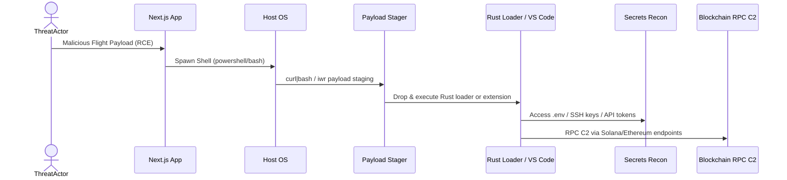
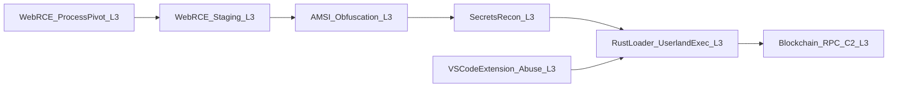

# 

<h1 align="center">React2Shell + EtherRAT Unified Detection Framework</h1>
<h3 align="center">Advanced Behavioural Rulepack & Analyst Handbook</h3>
<h4 align="center">Authored by Ala Dabat (azdabat)</h4>

---

# Table of Contents
1. [Introduction](#1-introduction)  
2. [React2Shell Threat Overview](#2-react2shell-threat-overview)  
3. [EtherRAT Threat Overview](#3-etherrat-threat-overview)  
4. [Combined Kill Chain: React2Shell → EtherRAT](#4-combined-kill-chain-react2shell--etherrat)  
5. [MITRE ATT&CK Mapping](#5-mitre-attck-mapping)  
6. [Detection Engineering Philosophy](#6-detection-engineering-philosophy)  
7. [Why Segmentation is Required](#7-why-segmentation-is-required)  
8. [Detection Rule Families](#8-detection-rule-families)  
9. [Rule Repository Structure](#9-rule-repository-structure)  
10. [Coverage & Overlap Diagram](#10-coverage--overlap-diagram)  
11. [SOC Workflow Integration](#11-soc-workflow-integration)  
12. [Appendix A: Analyst Triage Handbook](#appendix-a-analyst-triage-handbook)  

---

# 1. Introduction

This repository provides a **unified detection framework** for two rapidly evolving intrusion patterns:

- **React2Shell**: A modern Remote Code Execution (RCE) pathway resulting from unsafe deserialization in React/Next.js (React Flight protocol).  
- **EtherRAT**: A Rust-based implant distributed through supply-chain abuse and communicating via Web3 blockchain RPC endpoints.

These threats are increasingly **interconnected**:

- React2Shell grants **initial access → shell → stager**
- EtherRAT serves as the **implant → persistence → C2**

This framework provides:

- Behaviour-first detection logic  
- Segmented high-fidelity hunts  
- MITRE mapping  
- Attack-chain analysis  
- SOC workflows  
- Analyst Handbook appendixed into the same README  
- Links to your central rule repository:  
  **https://github.com/azdabat/Core-Threat-Hunts**

---

# 2. React2Shell Threat Overview

React2Shell exploits weaknesses in **Next.js React Flight deserialization**, allowing attackers to trigger:

- Arbitrary code execution  
- Shell spawning under web processes  
- curl/wget/iwr staging  
- Encoded PowerShell payloads  
- AMSI bypasses  

### Why This Matters

A web process spawning a shell is **one of the highest-fidelity signals** of exploitation in modern web stacks.

---

## React2Shell Attack Flow (ASCII)

```
[Attacker]
    |
    v
[Malicious React Flight Payload]
    |
    v
[Next.js RCE → Node/Web Worker]
    |
    v
[Web Process Spawns Shell]
    |
    v
[curl|bash or iwr Download]
    |
    v
[Encoded / AMSI-bypassed Payload]
```

---

# 3. EtherRAT Threat Overview

EtherRAT blends:

- Rust-based loader execution  
- Developer environment compromise (VS Code)  
- Secrets harvesting (.env, SSH keys, API tokens)  
- Blockchain RPC C2 via Solana/Ethereum networks  

This enables:

- Stealthy persistence  
- Nontraditional C2 channels  
- Strong evasion in developer-heavy environments  

---

# 4. Combined Kill Chain: React2Shell → EtherRAT

React2Shell commonly delivers **stagers**, which download and deploy **Rust implants** or malicious VS Code extensions that lead to EtherRAT execution.



---

# 5. MITRE ATT&CK Mapping

| Phase | Technique | Description | Rule |
|-------|-----------|-------------|------|
| Initial Access | **T1190** | Web RCE (Next.js) | WebRCE_ProcessPivot_L3 |
| Execution | **T1059** | Shell execution | WebRCE_ProcessPivot_L3 |
| Execution | **T1105** | Payload staging | WebRCE_Staging_L3 |
| Defence Evasion | **T1027** | Encoded execution | AMSI_Obfuscation_L3 |
| Defence Evasion | **T1562.001** | AMSI bypass | AMSI_Obfuscation_L3 |
| Credential Access | **T1552** | Secrets/keys access | SecretsRecon_L3 |
| Persistence | **T1547 / T1195** | VS Code extension abuse | VSCodeExtension_Abuse_L3 |
| Execution | **T1059/Compiled** | Rust loaders | RustLoader_UserlandExec_L3 |
| C2 | **T1102** | Blockchain/Web3 RPC | Blockchain_RPC_C2_L3 |

---

# 6. Detection Engineering Philosophy

We follow these principles:

### 1. **No monolithic rules**
Large “catch-all” detections produce noise and fail silently.  

### 2. **Segmented hunts**
Each behavioural surface gets its own high-fidelity rule.

### 3. **Behaviour > IOC**
Both React2Shell and EtherRAT mutate rapidly; behaviour does not.

### 4. **Telemetry-first design**
Rules map cleanly to Sentinel tables:
- DeviceProcessEvents  
- DeviceFileEvents  
- DeviceNetworkEvents  

### 5. **SOC-ready output**
Each rule includes:
- Clear purpose  
- Clean scoring logic  
- Hunter directives  
- IR guidance  

---

# 7. Why Segmentation is Required

| Behaviour | Reason for Separate Rule |
|----------|---------------------------|
| Web process spawning shell | High-fidelity RCE signal; must not be diluted |
| Staging (curl|bash, iwr) | Common in automation, requires separate tuning |
| AMSI + obfuscation | Occurs across entire estate, not just RCE workloads |
| Secrets access | Noisy on dev machines, critical severity |
| VS Code extension abuse | Developer-specific supply chain attack |
| Rust loader | Detects modern, compiled malware families |
| RPC C2 | High noise without asset tagging |

Segmentation = **fidelity + clarity + proper SOC workflows**.

---

# 8. Detection Rule Families

### 8.1 WebRCE Rules  
Category: `/WebRCE/`

- **WebRCE_ProcessPivot_L3**  
  Detects web server → shell (core RCE signal)  
  https://github.com/azdabat/Core-Threat-Hunts/tree/main/WebRCE  

- **WebRCE_Staging_L3**  
  Detects iwr/curl/wget staging  
  https://github.com/azdabat/Core-Threat-Hunts/tree/main/WebRCE  

---

### 8.2 Obfuscation Rules  
Category: `/Obfuscation/`

- **AMSI_Obfuscation_L3**  
  High-fidelity encoded payload + AMSI bypass detection  
  https://github.com/azdabat/Core-Threat-Hunts/tree/main/Obfuscation  

---

### 8.3 Secrets & Credential Rules  
Category: `/Secrets/`

- **SecretsRecon_L3**  
  Detects access to SSH keys, .env files, cloud tokens  
  https://github.com/azdabat/Core-Threat-Hunts/tree/main/Secrets  

---

### 8.4 Developer Environment / Supply Chain  
Category: `/DevEnvironment/`

- **VSCodeExtension_Abuse_L3**  
  Detects malicious extension installs + execution  
  https://github.com/azdabat/Core-Threat-Hunts/tree/main/DevEnvironment  

---

### 8.5 EtherRAT Userland Execution  
Category: `/EtherRAT/`

- **RustLoader_UserlandExec_L3**  
  Detects unsigned Rust malware in user paths  
  https://github.com/azdabat/Core-Threat-Hunts/tree/main/EtherRAT  

- **Blockchain_RPC_C2_L3**  
  Detects C2 over Solana/Ethereum RPC  
  https://github.com/azdabat/Core-Threat-Hunts/tree/main/EtherRAT  

---

# 9. Rule Repository Structure

```
/WebRCE/
    WebRCE_ProcessPivot_L3.kql
    WebRCE_Staging_L3.kql

/Obfuscation/
    AMSI_Obfuscation_L3.kql

/Secrets/
    SecretsRecon_L3.kql

/DevEnvironment/
    VSCodeExtension_Abuse_L3.kql

/EtherRAT/
    RustLoader_UserlandExec_L3.kql
    Blockchain_RPC_C2_L3.kql
```

---

# 10. Coverage & Overlap Diagram



---

# 11. SOC Workflow Integration

| Rule | SOC Tier | Action |
|------|----------|--------|
| WebRCE_ProcessPivot_L3 | **Tier 3** | Auto-isolate. Pull logs. Confirm RCE. |
| WebRCE_Staging_L3 | **Tier 2** | Investigate. Check URL/IP reputation. |
| AMSI_Obfuscation_L3 | **Tier 3** | Critical evasion. Decode payloads. |
| SecretsRecon_L3 | **Tier 3** | Credential rotation required. |
| VSCodeExtension_Abuse_L3 | **Tier 2** | Validate extension. Check drops. |
| RustLoader_UserlandExec_L3 | **Tier 3** | Malware execution. Contain host. |
| Blockchain_RPC_C2_L3 | **Tier 2/3** | Check for beaconing. Correlate with loader. |

---

# Appendix A: Analyst Triage Handbook

## A1. WebRCE_ProcessPivot_L3  
**Meaning:** Web process spawned shell (RCE).  
**Action:**  
- Isolate server  
- Review logs  
- Pivot to staging behaviour  
- Pull full process tree  

---

## A2. WebRCE_Staging_L3  
**Meaning:** curl|bash / iwr payload staging  
**Action:**  
- Retrieve URLs  
- Hash downloads  
- Check follow-on execution  

---

## A3. AMSI_Obfuscation_L3  
**Meaning:** Encoded/reflective execution + AMSI bypass  
**Action:**  
- Decode payload  
- Check parent process  
- Look for credential theft  

---

## A4. SecretsRecon_L3  
**Meaning:** Access to `.env`, SSH keys, tokens  
**Action:**  
- Validate expected process  
- Check for exfil  
- Rotate credentials  

---

## A5. VSCodeExtension_Abuse_L3  
**Meaning:** Suspicious extension install  
**Action:**  
- Validate publisher  
- Inspect dropped binaries  

---

## A6. RustLoader_UserlandExec_L3  
**Meaning:** Unsigned implant executed  
**Action:**  
- Check file signature  
- Inspect network events  
- Look for persistence  

---

## A7. Blockchain_RPC_C2_L3  
**Meaning:** Web3 RPC connection used as C2  
**Action:**  
- Identify parent  
- Check for beaconing  
- Validate asset role  

---

# End of Unified README.md
