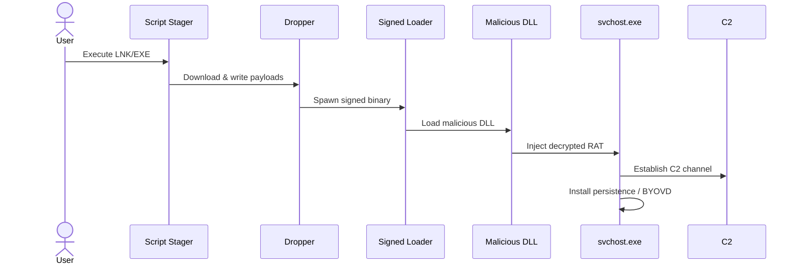

# 

<h1 align="center">SilverFox / ValleyRAT – Advanced Detection Engineering Study</h1>
<h3 align="center">Authored by Ala Dabat</h3>

---

# Table of Contents
- [1. Introduction](#1-introduction)
- [2. Threat Overview](#2-threat-overview)
- [3. Detection Engineering Philosophy](#3-detection-engineering-philosophy)
- [4. Threat Modelling SOP](#4-threat-modelling-sop)
- [5. MITRE Mapping](#5-mitre-mapping)
- [6. Complete Attack Chain](#6-complete-attack-chain)
- [7. Attack Chain Diagrams](#7-attack-chain-diagrams)
- [8. Why Segmentation Was Necessary](#8-why-segmentation-was-necessary)
- [9. Segmented Detection Architecture](#9-segmented-detection-architecture)
- [10. High-Level Rule Responsibilities](#10-high-level-rule-responsibilities)

---

# 1. Introduction

This repository documents the complete engineering process used to design **high-fidelity, production-ready detection rules** for the SilverFox / ValleyRAT intrusion framework.  
Unlike typical rulepacks that simply list queries, this study follows a **full threat-modelling and incident-response aligned methodology**, similar in depth and structure to the *Stego Loader* research.

**This README is a complete detection-engineering deliverable**, including:

- full attack-chain reconstruction  
- threat modelling  
- MITRE mapping  
- behavioural studies  
- ASCII + mermaid diagrams  
- segmentation logic  
- reasoning for each rule  
- fidelity vs. noise considerations  
- coverage matrices  
- IR workflow integration  

This is the same methodology used in professional threat research, detection engineering teams, and high-tier SOC environments.

---

# 2. Threat Overview

SilverFox (aka ValleyRAT) is a modular RAT and loader framework used heavily by Chinese APT clusters.  
It supports:

- **DLL sideloading using signed binaries**
- **script-based stagers (PowerShell, Certutil, BITS)**
- **multi-process loader chains**
- **direct memory injection (svchost.exe, msbuild.exe)**
- **BYOVD deployments**
- **persistence via scheduled tasks + Run keys**
- **data exfiltration + credential theft**

The malware survives because it **changes only the delivery method**, while **core behaviours stay identical**.

This makes SilverFox the perfect case study for **behavioural detection engineering**.

---

# 3. Detection Engineering Philosophy

SilverFox initially appears as a simple DLL sideloading RAT.  
Most defenders try to build **one giant detection rule** to catch it.

That always fails.

Why?

1. **Monolithic rules are fragile**  
If the attacker changes *one step*, the entire detection chain collapses.

2. **Telemetry mismatch**  
Different stages use entirely different tables (Process, File, Registry, Network, ImageLoad).  
Trying to join everything into one massive rule causes:
- timeouts  
- partial data drops  
- silent failures  

3. **Fidelity variance**  
High-fidelity signals (Process Injection) get overwhelmed by low-fidelity ones (Network events).

4. **SOC response speed**  
Some detections require *immediate isolation*, and others require *analyst triage*.  
These must not trigger as the same alert.

So instead of a monolithic rule, we built a **segmented, defence-in-depth architecture**, each segment aligned to MITRE technique categories and IR priorities.

---

# 4. Threat Modelling SOP

This research followed a strict, reproducible SOP:

### **4.1 Attack Surface Enumeration**
We map **all possible entry points**:

- standalone EXEs  
- malicious installers  
- LNK stagers  
- HTML/JS stagers  
- PowerShell downloaders  
- PDF-triggered script chains  

### **4.2 Behavioural Decomposition**
We break the malware into stages:

1. Initial Access  
2. Stage-1 Downloader  
3. Stage-2 Loader  
4. DLL Sideloading  
5. Memory Injection  
6. Persistence Establishment  
7. BYOVD Deployment  
8. Exfiltration  

Each stage becomes either:

- a **rule**, or  
- an **enrichment component** for a broader rule  

### **4.3 Telemetry Mapping**
We list relevant Sentinel/MDE tables:

- DeviceProcessEvents  
- DeviceImageLoadEvents  
- DeviceFileEvents  
- DeviceRegistryEvents  
- DeviceNetworkEvents  
- DeviceEvents  

### **4.4 Fidelity Assessment**
Each behaviour is categorised:

| Behaviour | Fidelity | Notes |
|----------|----------|-------|
| DLL sideloading into signed loader | High | Core ValleyRAT pattern |
| Memory injection | Very High | Almost no false positives |
| Script download stagers | Medium | Many benign admin ops |
| Network-only detections | Low | Too noisy |

### **4.5 Segmentation Decision**
Rules were segmented based on:

- high-fidelity actions (isolate immediately)  
- medium-fidelity stagers (investigate)  
- low-fidelity enrichments (context only)  

---

# 5. MITRE Mapping

| MITRE Tactic | Technique | Description | Rule |
|--------------|-----------|-------------|------|
| TA0002 Execution | **T1204** | User execution of fake installers | Core Sideload |
| TA0002 Execution | **T1059** | Command/Scripting (PS/CMD/Certutil) | Script Stager |
| TA0003 Persistence | **T1053.005** | Scheduled Task persistence | Advanced Kill Chain |
| TA0003 Persistence | **T1547.001** | Registry Run key | Advanced Kill Chain |
| TA0005 Defense Evasion | **T1574.002** | DLL Sideloading | Core Sideload |
| TA0005 Defense Evasion | **T1055** | Process Injection | Injection Rule |
| TA0008 Lateral Movement | **T1021** | RAT remote control | Advanced Kill Chain |
| TA0010 Exfiltration | **T1041** | C2 data exfil | Advanced Kill Chain |
| TA0004 Priv-Esc | **T1014** | Rootkit / Driver Load | BYOVD Rule |

---

# 6. Complete Attack Chain

Below is the behavioural kill chain we modelled from all available intelligence (APT writeups, telemetry reports, sandbox behaviours, and reverse engineering notes):

### **STAGE 0 — Delivery**
- Phishing ZIP/ISO containing LNK or EXE  
- Compromised websites serving fake installers  
- Weaponised PDFs spawning scripts  

### **STAGE 1 — Script Stager**
- powershell.exe → Invoke-WebRequest  
- certutil.exe → -urlcache -split -f  
- bitsadmin → download / transfer  

### **STAGE 2 — Dropper**
- Writes disguised EXEs, DLLs, or DAT blobs into Downloads / ProgramData  
- Spawns a child process that becomes the loader  

### **STAGE 3 — Signed Loader Execution**
- Signed EXE (Foxit, WeChat, Tencent, etc.) loads malicious DLL via search order hijack  

### **STAGE 4 — Memory Execution / Injection**
- Loader decrypts RAT shellcode  
- Injects into svchost.exe / msbuild.exe  

### **STAGE 5 — Persistence**
- Hidden Scheduled Tasks  
- Run keys  
- AppData-based loaders  

### **STAGE 6 — BYOVD / Rootkit**
- Drops .sys driver  
- Creates service via SC or registry  

### **STAGE 7 — C2 + Exfil**
- Raw TCP/UDP over non-standard ports  
- Compressed archive exfiltration  

---

# 7. Attack Chain Diagrams
## 7.1 Full Kill Chain (ASCII)
~~~
[User Clicks Payload]
|
v
[Script Stager] --(downloads)--> [Dropper]
|
v
[Signed Loader (Foxit/WeChat)]
|
(DLL Sideload)
|
v
[Malicious DLL] --> [Decryption] --> [Shellcode]
|
(Process Injection)
|
v
[svchost.exe] -----> [Persistence] -----> [C2]-> [BYOVD Rootkit]
~~~

---

## 7.2 Mermaid Sequence Diagram


# 8. Why Segmentation Was Necessary

Monolithic rules failed for four primary reasons:

1. **Fragility**
   - If a single step changes (dropper → loader handoff), the full chain breaks.
   - ValleyRAT frequently swaps delivery vectors (EXE, LNK, PDF, ISO).

2. **Telemetry Blindspots**
   - Script stagers use DeviceProcessEvents + DeviceFileEvents.
   - Core sideloading uses DeviceImageLoadEvents.
   - Injection uses DeviceProcessEvents only.
   - Persistence uses DeviceRegistryEvents + DeviceEvents.
   No single query can reliably stitch these without timeouts.

3. **Fidelity Variance**
   - Script downloaders = Medium fidelity.
   - DLL sideloading = High fidelity.
   - Memory injection = Very High fidelity.
   Mixing them produces inconsistent alert priorities.

4. **IR Requirements**
   - Injection MUST be an immediate P1 isolation.
   - Script downloaders MUST NOT be auto-isolated.
   Segmentation allows different IR playbooks per detection.

Result:
We engineered **five smaller, stronger rules**, each tightly scoped and mapped to MITRE + IR priorities.

# 9. Segmented Detection Architecture
Below is the detection architecture we built for SilverFox/ValleyRAT.

flowchart TD

A[Script Stager Rule] --> B[Core Sideload Rule]
B --> C[Injection Rule]
C --> D[Advanced Kill Chain Dashboard]
B --> E[BYOVD Driver Rule]

style A fill:#1e90ff,stroke:#000,color:#fff
style B fill:#32cd32,stroke:#000,color:#fff
style C fill:#ff4500,stroke:#000,color:#fff
style D fill:#8a2be2,stroke:#000,color:#fff
style E fill:#ffd700,stroke:#000,color:#000

Each rule corresponds to one MITRE technique category and one incident-response priority:

| Rule | MITRE Tactic | Technique | Fidelity | IR Priority |
|------|--------------|-----------|----------|-------------|
| Script Stager | Execution | T1059 | Medium | P2 |
| Core Sideload | Defense Evasion | T1574.002 | High | P1 |
| Injection | Defense Evasion | T1055 | Very High | P1 Auto-Isolate |
| BYOVD | Priv Esc / Evasion | T1014 | High | P1 |
| Advanced Kill Chain | All | Multi | Variable | IR Reporting |

# 10. High-Level Rule Responsibilities

### SilverFox_ScriptStager.kql
Purpose: Detects suspicious script-based downloaders.
Why separate?
- Medium fidelity.
- Prevents FP contamination of high-fidelity detections.

### SilverFox_Core_Sideload.kql
Purpose: Detects signed loader → DLL sideload in user paths.
Why separate?
- This is the behavioural backbone of ValleyRAT.

### SilverFox_Injection.kql
Purpose: Detects memory injection into svchost/msbuild.
Why separate?
- Nearly zero false positives.
- Auto-isolation candidate.

### SilverFox_BYOVD.kql
Purpose: Detects driver drops and service creation.
Why separate?
- Required to map post-exploitation escalation.

### SilverFox_Advanced_KillChain.kql
Purpose: Correlates all phases of attack over 48h.
Why separate?
- Expensive joins.
- Used by IR, not for real-time alerting.

# 11. Rule Set Overview

This section documents the five rule families that make up the **SilverFox / ValleyRAT Behavioural Detection Framework**.  
The rules live in the `/rules/` folder as:

- `rules/SilverFox_ValleyRAT_ScriptStager.kql`
- `rules/SilverFox_ValleyRAT_Core_Sideload.kql`
- `rules/SilverFox_ValleyRAT_Injection.kql`
- `rules/SilverFox_ValleyRAT_BYOVD.kql`
- `rules/SilverFox_ValleyRAT_Advanced_KillChain.kql`

Each rule is:

- **behaviour-first** (no hash / static IOC dependence)  
- designed to be **environment-agnostic but tuneable**  
- aligned to **MITRE** and **IR priorities**  
- written to **avoid “math as a gate”** – scoring is used to prioritise, not to hide detections  

At a high level:

| Rule | Stage | Purpose |
|------|--------|---------|
| ScriptStager | Stage 1 | Detect script-based downloaders/dropper mechanics |
| Core_Sideload | Stage 3–4 | Detect signed-loader + DLL sideload in user paths |
| Injection | Stage 4 | Detect process injection into svchost/msbuild/etc. |
| BYOVD | Stage 6 | Detect driver drops + service creation + timestamp abuse |
| Advanced_KillChain | Stage 1–7 | Correlate all phases into one narrative for IR |

---

# 12. Rule Definitions & Behaviour (Per File)

Below are **summaries** and **core logic patterns** for each rule.  
The full queries are stored in `/rules/` and should be treated as L3-ready artefacts.

---

## 12.1 Script Stager Hunt  
`rules/SilverFox_ValleyRAT_ScriptStager.kql`

**Goal:** Catch Stage-1 downloaders (PowerShell / CMD / Certutil / BITS / WScript) that download payloads into user-writable directories and immediately drop an EXE/DLL.

**Key telemetry:**

- `DeviceProcessEvents` – script engine execution  
- `DeviceFileEvents` – EXE/DLL drops  
- 10-minute **tight time window** per host/process  

**Core logic pattern (simplified):**

```kql
// SILVERFOX / VALLEYRAT – SCRIPT STAGER HUNT (Stage 1)
let Lookback = 48h;
let WritablePaths = dynamic(["\\Users\\","\\Downloads\\","\\Desktop\\","\\Temp\\","\\ProgramData\\","\\Public\\"]);

// 1) Script / LOLBin stager
let ScriptEvents =
DeviceProcessEvents
| where Timestamp > ago(Lookback)
| where FileName in~ ("powershell.exe","cmd.exe","mshta.exe","wscript.exe","cscript.exe","certutil.exe","bitsadmin.exe")
| where ProcessCommandLine has_any (
    "iwr","wget","curl","Invoke-WebRequest","DownloadFile","DownloadString",
    "Net.WebClient","Start-BitsTransfer","bitsadmin",
    "urlcache","-split","ADODB.Stream","XMLHTTP"
)
| project DeviceId, ScriptTime=Timestamp, ScriptPid=ProcessId,
          ScriptName=FileName, ScriptCmd=ProcessCommandLine,
          ScriptParent=InitiatingProcessFileName;

// 2) Executable/DLL drops into user-writable folders
let FileDrops =
DeviceFileEvents
| where Timestamp > ago(Lookback)
| where FileName matches regex @"\.(exe|dll)$"
| where FolderPath has_any (WritablePaths)
| project DeviceId, DropTime=Timestamp, DroppedFile=FileName,
          DropPath=FolderPath, DropperPid=InitiatingProcessId;

// 3) Correlate: same PID, within 10m
ScriptEvents
| join kind=inner (FileDrops) on DeviceId
| where DropperPid == ScriptPid
| where DropTime between (ScriptTime .. ScriptTime + 10m)
| summarize FirstSeen=min(ScriptTime),
            ScriptCmd=any(ScriptCmd),
            DroppedFiles=make_set(DroppedFile, 10),
            DropPaths=make_set(DropPath, 10)
   by DeviceId, ScriptName, ScriptParent
| extend Severity = "High",
         HunterDirective = strcat(
           "HIGH: Script-based stager. ", ScriptName,
           " (parent: ", ScriptParent,
           ") executed download command and dropped payload(s) ",
           tostring(DroppedFiles), " into ", tostring(DropPaths),
           ". Review ScriptCmd and destination domains; consider blocking if unapproved."
         )
| order by FirstSeen desc
